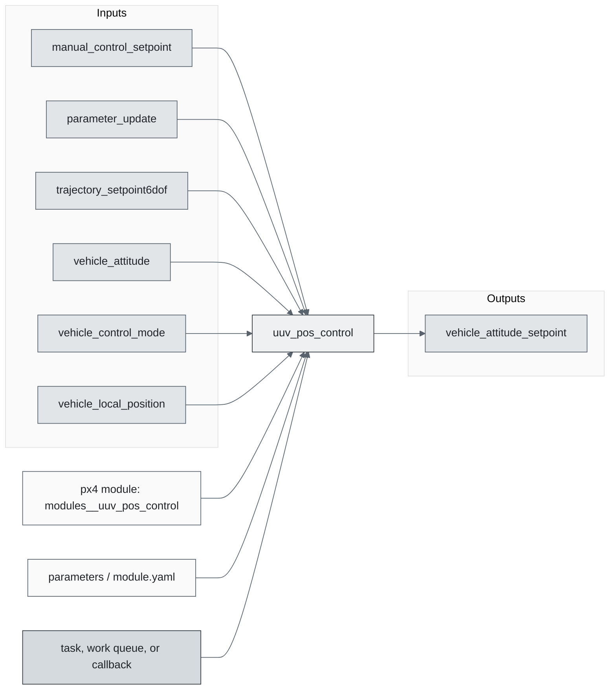
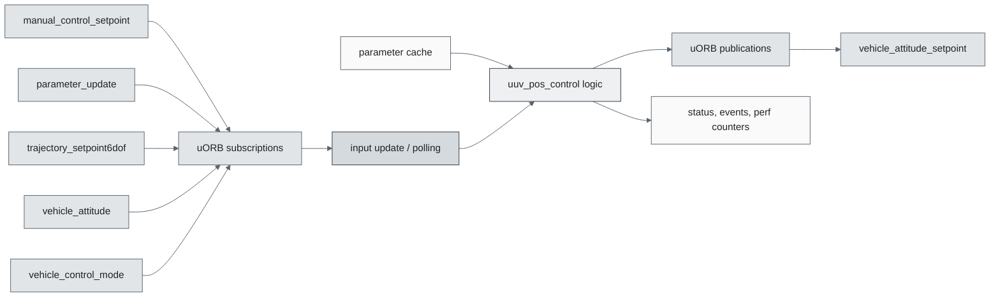
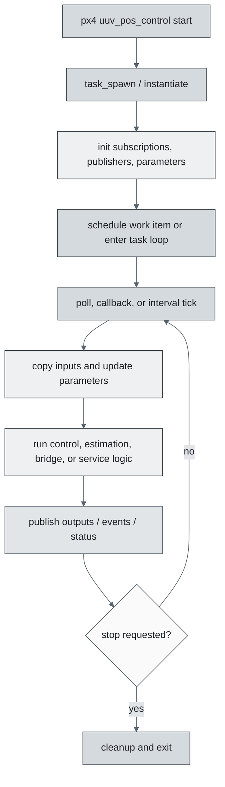
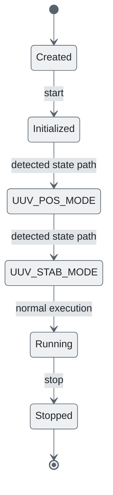
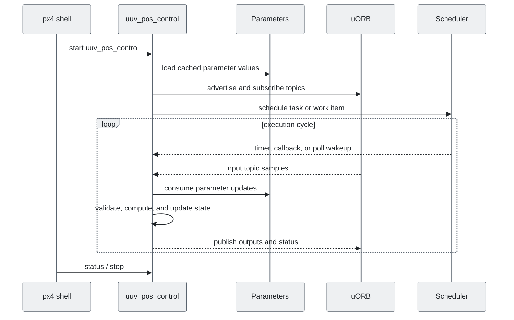
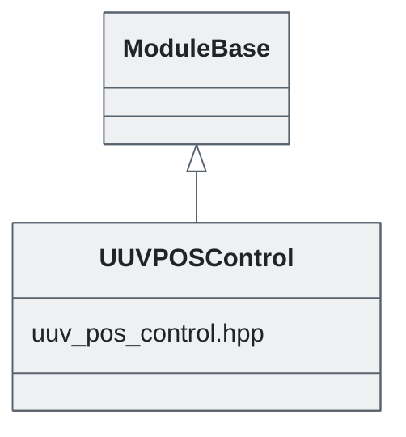

# PX4 Module Architecture: `uuv_pos_control`

- Source: `src/modules/uuv_pos_control`
- Build target: `modules__uuv_pos_control`
- Runtime main: `uuv_pos_control`
- Build kind: `px4 module`
- Mermaid palette: `slate` grey tone

Source-derived architecture notes for this PX4 module directory.

## Architecture Overview

This page is generated from the module source tree and shows the stable architecture surfaces: build entry point, scheduling shape, uORB data interfaces, parameter/configuration surfaces, and C++ types found in the module.

## Build and Entry Points

| Field | Value |
| --- | --- |
| Module path | src/modules/uuv_pos_control |
| Build kind | px4 module |
| Build target | modules__uuv_pos_control |
| Runtime main | uuv_pos_control |
| Stack main | 1200 |
| Module config | uuv_pos_control_params.yaml |
| Detected sources | 1 |
| Detected headers | 1 |
| Detected configs | 2 |

### CMake Dependencies

- No explicit CMake dependencies detected.

### Nested Module Targets

- No nested module targets detected.

## Data Flow

### uORB Topics

| Topic | Detected direction |
| --- | --- |
| manual_control_setpoint | subscribed |
| parameter_update | subscribed |
| trajectory_setpoint6dof | subscribed |
| vehicle_angular_velocity | referenced |
| vehicle_attitude | subscribed |
| vehicle_attitude_setpoint | published |
| vehicle_control_mode | subscribed |
| vehicle_local_position | subscribed |
| vehicle_rates_setpoint | referenced |

## Execution Flow

The common PX4 module lifecycle is command entry, object construction or task spawn, parameter loading, topic setup, scheduled execution, publication, status reporting, and stop/cleanup. Modules that use `ModuleBase`, `ScheduledWorkItem`, polling loops, or bridge callbacks still fit this lifecycle with different scheduling triggers.

## State Machine

### Detected State-Like Symbols

- `UUV_POS_MODE`
- `UUV_STAB_MODE`

## Sequence Diagram

## Class Diagram

### Detected Classes

| Class | Base | File |
| --- | --- | --- |
| UUVPOSControl | ModuleBase | uuv_pos_control.hpp |

### Detected Enums

- No enums detected.

## Parameters and Configuration

- No parameters detected.

## Source Map

| File | Kind |
| --- | --- |
| CMakeLists.txt | build |
| uuv_pos_control.cpp | source |
| uuv_pos_control.hpp | header |
| uuv_pos_control_params.yaml | config |

## Review Notes

- The diagrams are generated from static source inventory and should be used as a study map, not as a formal proof of every runtime branch.
- Topic direction is inferred from nearby source context such as `Subscription`, `Publication`, `orb_subscribe`, and `publish` usage.
- When a module has no explicit state enum, the state diagram shows the standard PX4 module lifecycle.
