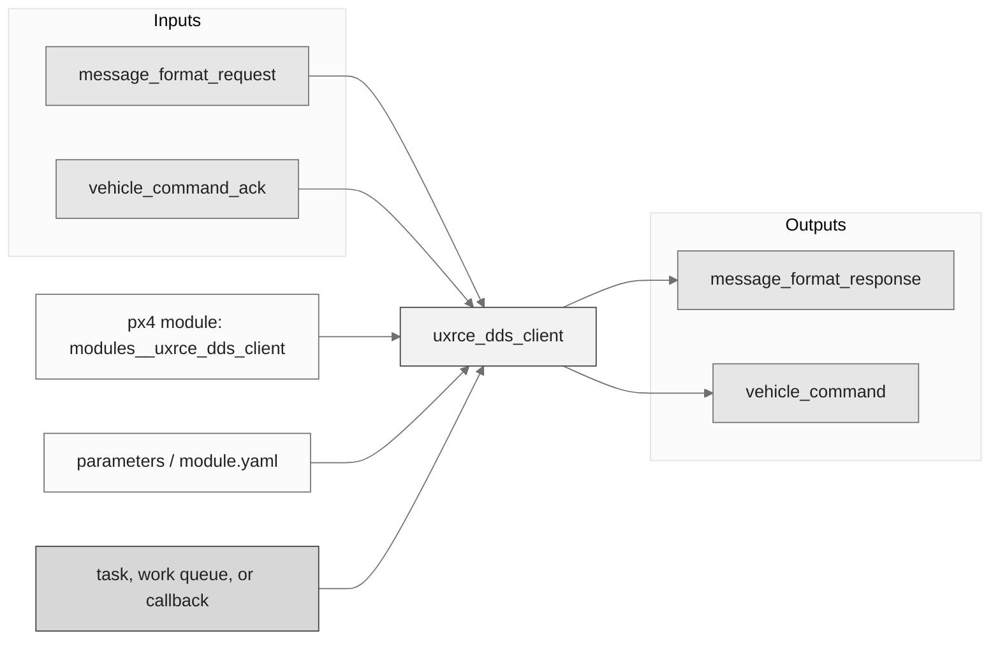
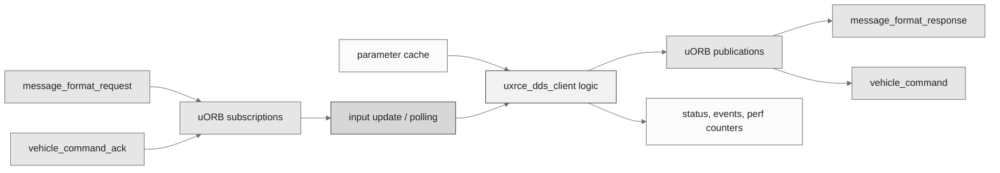
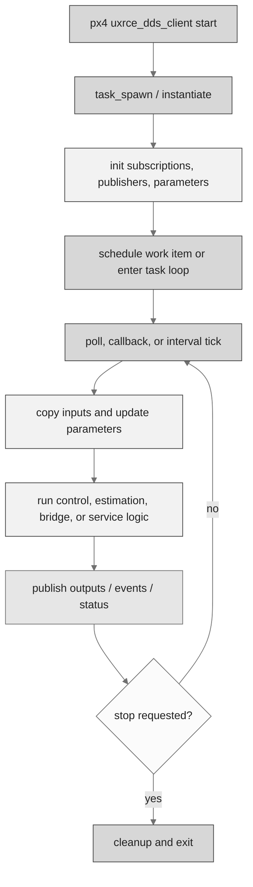
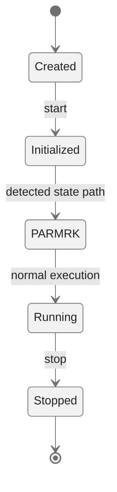
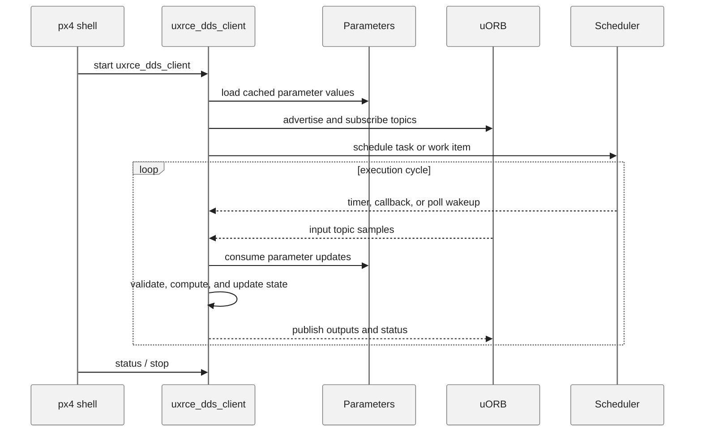
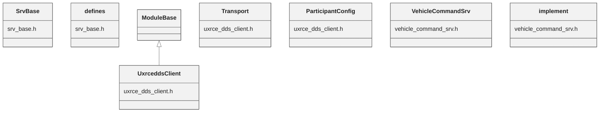

# PX4 Module Architecture: `uxrce_dds_client`

- Source: `src/modules/uxrce_dds_client`
- Build target: `modules__uxrce_dds_client`
- Runtime main: `uxrce_dds_client`
- Build kind: `px4 module`
- Mermaid palette: `ash` grey tone

Architecture notes for the UXRCE-DDS Client module.

## Architecture Overview

This page is generated from the module source tree and shows the stable architecture surfaces: build entry point, scheduling shape, uORB data interfaces, parameter/configuration surfaces, and C++ types found in the module.

## Build and Entry Points

| Field | Value |
| --- | --- |
| Module path | src/modules/uxrce_dds_client |
| Build kind | px4 module |
| Build target | modules__uxrce_dds_client |
| Runtime main | uxrce_dds_client |
| Stack main | 9000 |
| Module config | module.yaml |
| Detected sources | 3 |
| Detected headers | 4 |
| Detected configs | 3 |

### CMake Dependencies

- `git_micro_xrce_dds_client`
- `libmicroxrceddsclient_project`
- `microxrceddsclient`
- `libmicroxrceddsclient`
- `libmicrocdr`
- `timesync`
- `topic_bridge_files`
- `uorb_ucdr_headers`

### Nested Module Targets

- No nested module targets detected.

## Data Flow

### uORB Topics

| Topic | Detected direction |
| --- | --- |
| message_format_request | subscribed |
| message_format_response | published |
| uORBTopics | referenced |
| vehicle_command | published |
| vehicle_command_ack | subscribed |

## Execution Flow

The common PX4 module lifecycle is command entry, object construction or task spawn, parameter loading, topic setup, scheduled execution, publication, status reporting, and stop/cleanup. Modules that use `ModuleBase`, `ScheduledWorkItem`, polling loops, or bridge callbacks still fit this lifecycle with different scheduling triggers.

## State Machine

### Detected State-Like Symbols

- `PARMRK`

## Sequence Diagram

## Class Diagram

### Detected Classes

| Class | Base | File |
| --- | --- | --- |
| SrvBase |  | srv_base.h |
| defines |  | srv_base.h |
| UxrceddsClient | ModuleBase | uxrce_dds_client.h |
| Transport |  | uxrce_dds_client.h |
| ParticipantConfig |  | uxrce_dds_client.h |
| VehicleCommandSrv |  | vehicle_command_srv.h |
| implement |  | vehicle_command_srv.h |

### Detected Enums

- `ParticipantConfig`
- `Transport`

## Parameters and Configuration

- `UXRCE_DDS_AG_IP`
- `UXRCE_DDS_CFG`
- `UXRCE_DDS_DOM_ID`
- `UXRCE_DDS_FLCTRL`
- `UXRCE_DDS_KEY`
- `UXRCE_DDS_NS_IDX`
- `UXRCE_DDS_PRT`
- `UXRCE_DDS_PTCFG`
- `UXRCE_DDS_RX_TO`
- `UXRCE_DDS_SYNCC`
- `UXRCE_DDS_SYNCT`
- `UXRCE_DDS_TX_TO`

## Source Map

| File | Kind |
| --- | --- |
| CMakeLists.txt | build |
| dds_topics.yaml | config |
| module.yaml | config |
| srv_base.cpp | source |
| srv_base.h | header |
| utilities.hpp | header |
| uxrce_dds_client.cpp | source |
| uxrce_dds_client.h | header |
| vehicle_command_srv.cpp | source |
| vehicle_command_srv.h | header |

## Review Notes

- The diagrams are generated from static source inventory and should be used as a study map, not as a formal proof of every runtime branch.
- Topic direction is inferred from nearby source context such as `Subscription`, `Publication`, `orb_subscribe`, and `publish` usage.
- When a module has no explicit state enum, the state diagram shows the standard PX4 module lifecycle.
