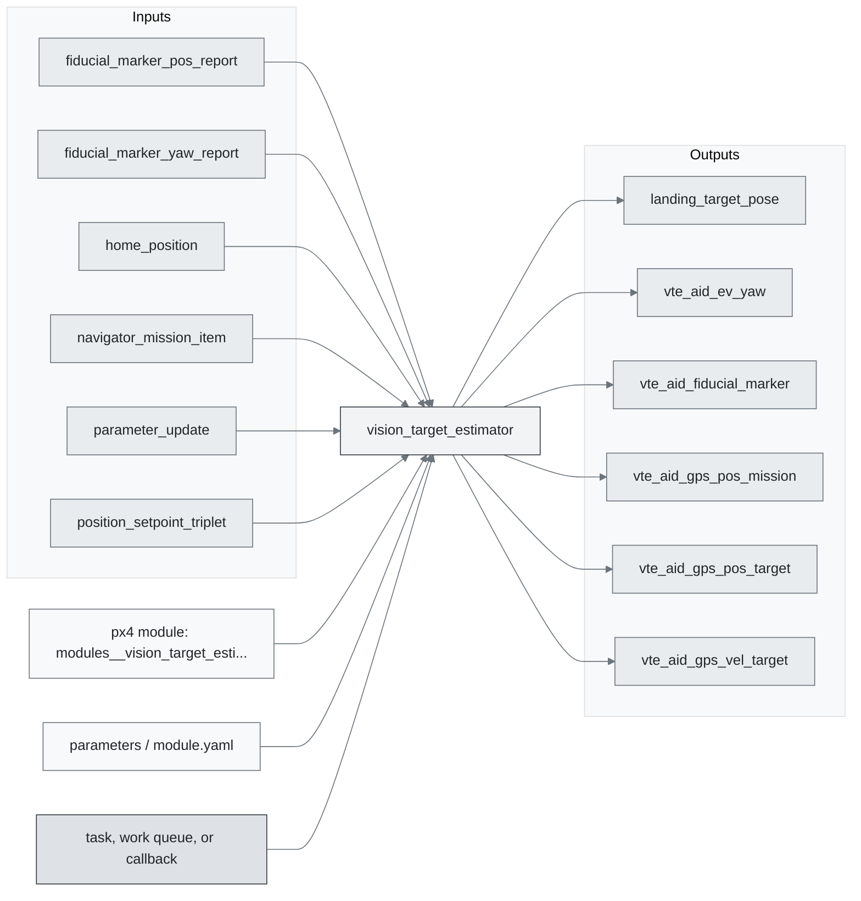
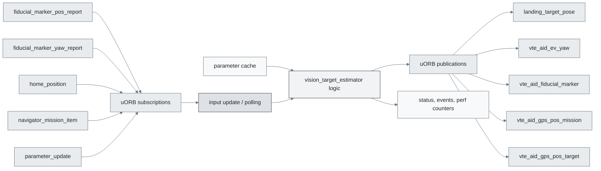
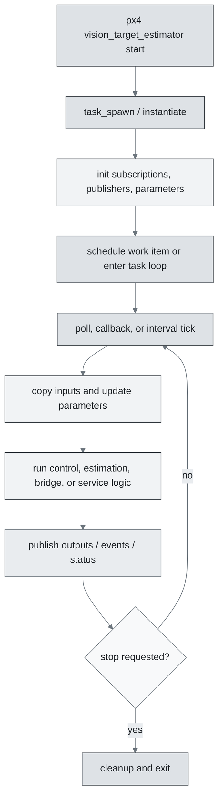
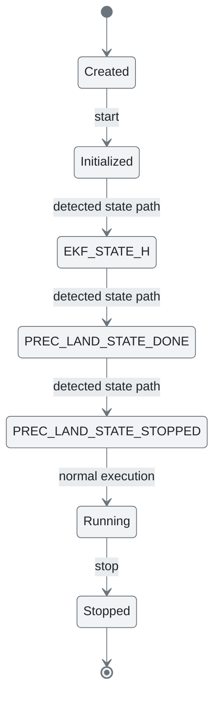
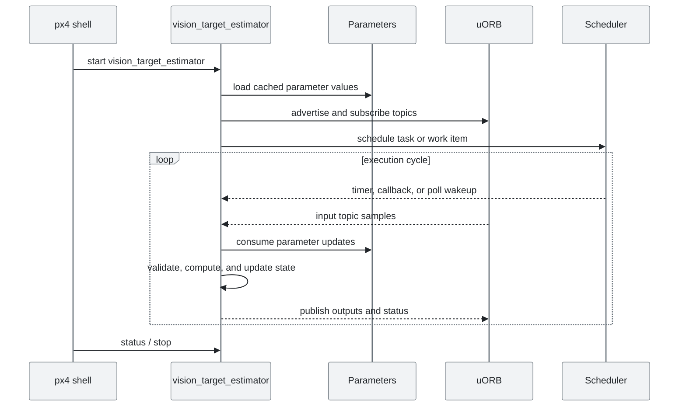

# PX4 Module Architecture: `vision_target_estimator`

- Source: `src/modules/vision_target_estimator`
- Build target: `modules__vision_target_estimator`
- Runtime main: `vision_target_estimator`
- Build kind: `px4 module`
- Mermaid palette: `mist` grey tone

Source-derived architecture notes for this PX4 module directory.

## Architecture Overview

This page is generated from the module source tree and shows the stable architecture surfaces: build entry point, scheduling shape, uORB data interfaces, parameter/configuration surfaces, and C++ types found in the module.

## Build and Entry Points

| Field | Value |
| --- | --- |
| Module path | src/modules/vision_target_estimator |
| Build kind | px4 module |
| Build target | modules__vision_target_estimator |
| Runtime main | vision_target_estimator |
| Stack main | Not specified |
| Module config | vision_target_estimator_params.yaml |
| Detected sources | 6 |
| Detected headers | 24 |
| Detected configs | 2 |

### CMake Dependencies

- `mathlib`
- `px4_work_queue`

### Nested Module Targets

- No nested module targets detected.

## Data Flow

### uORB Topics

| Topic | Detected direction |
| --- | --- |
| fiducial_marker_pos_report | subscribed |
| fiducial_marker_yaw_report | subscribed |
| home_position | subscribed |
| landing_target_pose | published |
| navigator_mission_item | subscribed |
| parameter_update | subscribed |
| position_setpoint_triplet | subscribed |
| prec_land_status | subscribed |
| sensor_gps | referenced |
| target_gnss | subscribed |
| vehicle_acceleration | subscribed |
| vehicle_angular_velocity | subscribed |
| vehicle_attitude | subscribed |
| vehicle_gps_position | subscribed |
| vehicle_land_detected | subscribed |
| vehicle_local_position | subscribed |
| vte_aid_ev_yaw | published |
| vte_aid_fiducial_marker | published |
| vte_aid_gps_pos_mission | published |
| vte_aid_gps_pos_target | published |
| vte_aid_gps_vel_target | published |
| vte_aid_gps_vel_uav | published |
| vte_aid_source1d | referenced |
| vte_aid_source3d | referenced |
| vte_bias_init_status | published |
| vte_input | published |
| vte_orientation | published |
| vte_position | published |

## Execution Flow

The common PX4 module lifecycle is command entry, object construction or task spawn, parameter loading, topic setup, scheduled execution, publication, status reporting, and stop/cleanup. Modules that use `ModuleBase`, `ScheduledWorkItem`, polling loops, or bridge callbacks still fit this lifecycle with different scheduling triggers.

## State Machine

### Detected State-Like Symbols

- `EKF_STATE_H`
- `PREC_LAND_STATE_DONE`
- `PREC_LAND_STATE_STOPPED`

## Sequence Diagram

## Class Diagram

```mermaid
%%{init: {"theme":"base","themeVariables":{"primaryColor":"#f1f3f5","secondaryColor":"#e9ecef","tertiaryColor":"#f8f9fa","primaryBorderColor":"#6c757d","primaryTextColor":"#212529","lineColor":"#6c757d","fontFamily":"Inter, Arial, sans-serif"}}}%%
classDiagram
  class KF_orientation
  KF_orientation : Orientation/KF_orientation.h
  class OOSMManager
  OOSMManager : Orientation/KF_orientation.h
  class VTEOrientation
  VTEOrientation : Orientation/VTEOrientation.h
  class ModuleParams
  ModuleParams <|-- VTEOrientation
  class KF_position
  KF_position : Position/KF_position.h
  class OOSMManager_4
  OOSMManager_4 : Position/KF_position.h
  class VTEPosition
  VTEPosition : Position/VTEPosition.h
  class ModuleParams
  ModuleParams <|-- VTEPosition
  class ObsType
  ObsType : Position/VTEPosition.h
  class PreBiasReference
  PreBiasReference : Position/VTEPosition.h
  class OOSMManager_8
  OOSMManager_8 : VTEOosm.h
  class VisionTargetEstTest
  VisionTargetEstTest : VisionTargetEst.h
  class VisionTargetEstTestable
  VisionTargetEstTestable : VisionTargetEst.h
  class VisionTargetEst
  VisionTargetEst : VisionTargetEst.h
  class ModuleBase
  ModuleBase <|-- VisionTargetEst
  class TimeSourceProvider
  TimeSourceProvider : common.h
  class VisionTargetEstTest_13
  VisionTargetEstTest_13 : tasks/PrecLandTask.h
  class VisionTargetEstTestable_14
  VisionTargetEstTestable_14 : tasks/PrecLandTask.h
  class VTEPosition_15
  VTEPosition_15 : tasks/PrecLandTask.h
```

### Detected Classes

| Class | Base | File |
| --- | --- | --- |
| KF_orientation |  | Orientation/KF_orientation.h |
| OOSMManager |  | Orientation/KF_orientation.h |
| VTEOrientation | ModuleParams | Orientation/VTEOrientation.h |
| KF_position |  | Position/KF_position.h |
| OOSMManager |  | Position/KF_position.h |
| VTEPosition | ModuleParams | Position/VTEPosition.h |
| ObsType |  | Position/VTEPosition.h |
| PreBiasReference |  | Position/VTEPosition.h |
| OOSMManager |  | VTEOosm.h |
| VisionTargetEstTest |  | VisionTargetEst.h |
| VisionTargetEstTestable |  | VisionTargetEst.h |
| VisionTargetEst | ModuleBase | VisionTargetEst.h |
| TimeSourceProvider |  | common.h |
| VisionTargetEstTest |  | tasks/PrecLandTask.h |
| VisionTargetEstTestable |  | tasks/PrecLandTask.h |
| VTEPosition |  | tasks/PrecLandTask.h |
| PrecLandTask |  | tasks/PrecLandTask.h |
| VTEPosition |  | tasks/VteTask.h |
| VteTask |  | tasks/VteTask.h |
| DebugTask |  | tasks/VteTask.h |

### Detected Enums

- `ObsType`
- `PreBiasReference`
- `State`
- `values`

## Parameters and Configuration

- No parameters detected.

## Source Map

| File | Kind |
| --- | --- |
| CMakeLists.txt | build |
| Orientation/KF_orientation.cpp | source |
| Orientation/KF_orientation.h | header |
| Orientation/VTEOrientation.cpp | source |
| Orientation/VTEOrientation.h | header |
| Orientation/vtest_derivation/generated/getTransitionMatrix.h | header |
| Orientation/vtest_derivation/generated/predictCov.h | header |
| Orientation/vtest_derivation/generated/predictState.h | header |
| Position/KF_position.cpp | source |
| Position/KF_position.h | header |
| Position/VTEPosition.cpp | source |
| Position/VTEPosition.h | header |
| Position/vtest_derivation/generated/applyCorrection.h | header |
| Position/vtest_derivation/generated/computeInnovCov.h | header |
| Position/vtest_derivation/generated/getTransitionMatrix.h | header |
| Position/vtest_derivation/generated/predictCov.h | header |
| Position/vtest_derivation/generated/predictState.h | header |
| Position/vtest_derivation/generated/state.h | header |
| Position/vtest_derivation/generated_moving/applyCorrection.h | header |
| Position/vtest_derivation/generated_moving/computeInnovCov.h | header |
| Position/vtest_derivation/generated_moving/getTransitionMatrix.h | header |
| Position/vtest_derivation/generated_moving/predictCov.h | header |
| Position/vtest_derivation/generated_moving/predictState.h | header |
| Position/vtest_derivation/generated_moving/state.h | header |
| VTEOosm.h | header |
| VisionTargetEst.cpp | source |
| VisionTargetEst.h | header |
| common.h | header |
| tasks/PrecLandTask.cpp | source |
| tasks/PrecLandTask.h | header |
| tasks/VteTask.h | header |
| vision_target_estimator_params.yaml | config |

## Review Notes

- The diagrams are generated from static source inventory and should be used as a study map, not as a formal proof of every runtime branch.
- Topic direction is inferred from nearby source context such as `Subscription`, `Publication`, `orb_subscribe`, and `publish` usage.
- When a module has no explicit state enum, the state diagram shows the standard PX4 module lifecycle.
