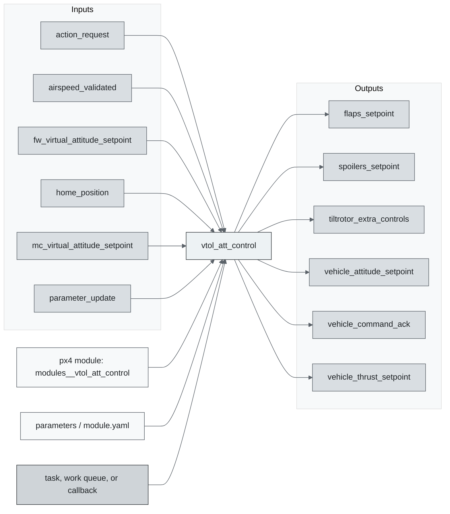
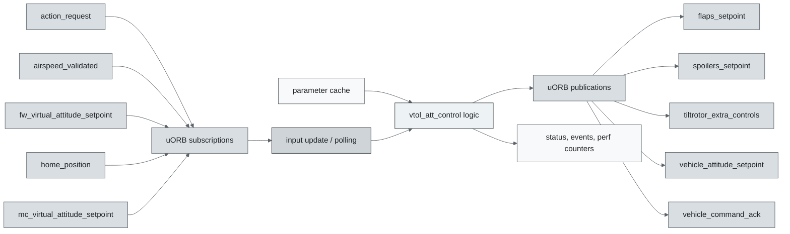
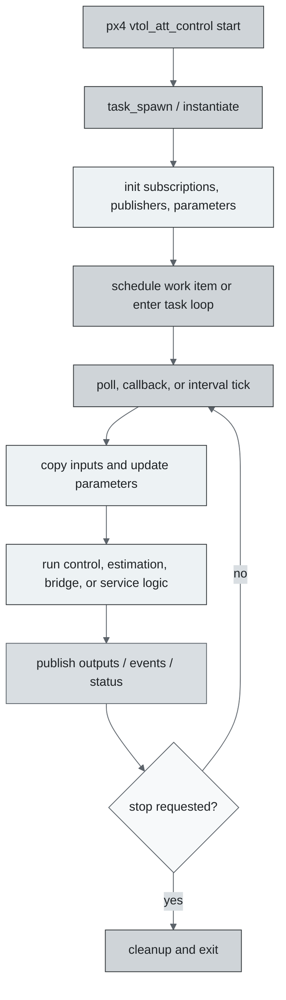
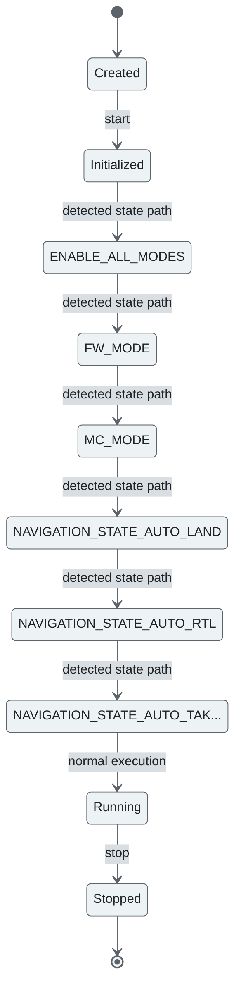
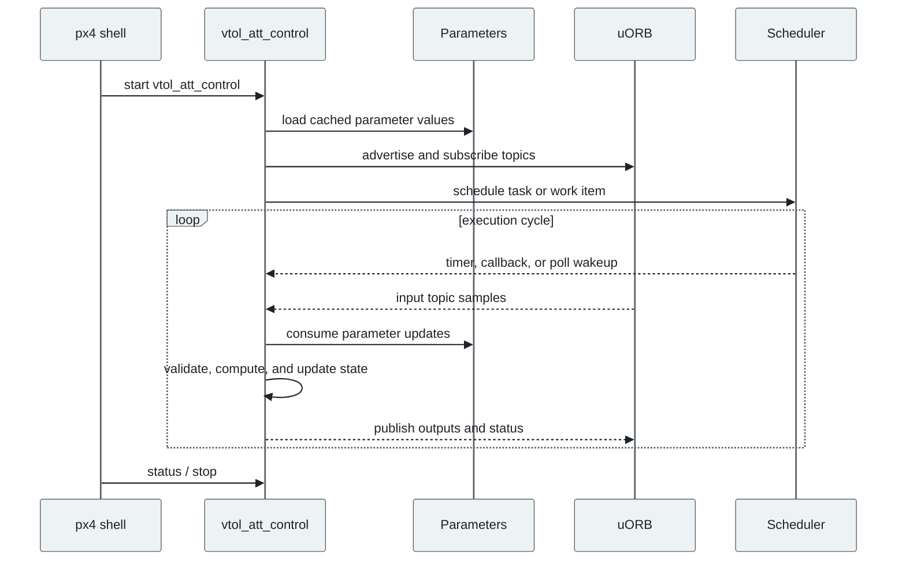
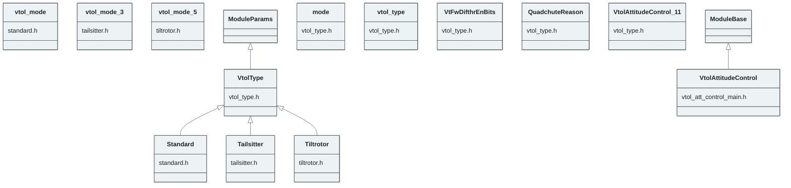

# PX4 Module Architecture: `vtol_att_control`

- Source: `src/modules/vtol_att_control`
- Build target: `modules__vtol_att_control`
- Runtime main: `vtol_att_control`
- Build kind: `px4 module`
- Mermaid palette: `graphite` grey tone

Source-derived architecture notes for this PX4 module directory.

## Architecture Overview

This page is generated from the module source tree and shows the stable architecture surfaces: build entry point, scheduling shape, uORB data interfaces, parameter/configuration surfaces, and C++ types found in the module.

## Build and Entry Points

| Field | Value |
| --- | --- |
| Module path | src/modules/vtol_att_control |
| Build kind | px4 module |
| Build target | modules__vtol_att_control |
| Runtime main | vtol_att_control |
| Stack main | Not specified |
| Module config | standard_params.yaml |
| Detected sources | 5 |
| Detected headers | 5 |
| Detected configs | 4 |

### CMake Dependencies

- No explicit CMake dependencies detected.

### Nested Module Targets

- No nested module targets detected.

## Data Flow

### uORB Topics

| Topic | Detected direction |
| --- | --- |
| action_request | subscribed |
| airspeed_validated | subscribed |
| flaps_setpoint | published |
| fw_virtual_attitude_setpoint | subscribed |
| home_position | subscribed |
| mc_virtual_attitude_setpoint | subscribed |
| normalized_unsigned_setpoint | referenced |
| parameter_update | subscribed |
| position_setpoint_triplet | subscribed |
| spoilers_setpoint | published |
| tecs_status | subscribed |
| tiltrotor_extra_controls | published |
| vehicle_air_data | subscribed |
| vehicle_attitude | subscribed |
| vehicle_attitude_setpoint | published |
| vehicle_command | subscribed |
| vehicle_command_ack | published |
| vehicle_control_mode | subscribed |
| vehicle_land_detected | subscribed |
| vehicle_local_position | subscribed |
| vehicle_local_position_setpoint | subscribed |
| vehicle_status | subscribed |
| vehicle_thrust_setpoint | published |
| vehicle_thrust_setpoint_virtual_fw | subscribed |
| vehicle_thrust_setpoint_virtual_mc | subscribed |
| vehicle_torque_setpoint | published |
| vehicle_torque_setpoint_virtual_fw | subscribed |
| vehicle_torque_setpoint_virtual_mc | subscribed |
| vtol_vehicle_status | published |

## Execution Flow

The common PX4 module lifecycle is command entry, object construction or task spawn, parameter loading, topic setup, scheduled execution, publication, status reporting, and stop/cleanup. Modules that use `ModuleBase`, `ScheduledWorkItem`, polling loops, or bridge callbacks still fit this lifecycle with different scheduling triggers.

## State Machine

### Detected State-Like Symbols

- `ENABLE_ALL_MODES`
- `FW_MODE`
- `MC_MODE`
- `NAVIGATION_STATE_AUTO_LAND`
- `NAVIGATION_STATE_AUTO_RTL`
- `NAVIGATION_STATE_AUTO_TAKEOFF`
- `NAVIGATION_STATE_DESCEND`
- `NAVIGATION_STATE_ORBIT`
- `VEHICLE_VTOL_STATE_FW`
- `VEHICLE_VTOL_STATE_MC`
- `VEHICLE_VTOL_STATE_TRANSITION_TO_FW`
- `VEHICLE_VTOL_STATE_TRANSITION_TO_MC`

## Sequence Diagram

## Class Diagram

### Detected Classes

| Class | Base | File |
| --- | --- | --- |
| Standard | VtolType | standard.h |
| vtol_mode |  | standard.h |
| Tailsitter | VtolType | tailsitter.h |
| vtol_mode |  | tailsitter.h |
| Tiltrotor | VtolType | tiltrotor.h |
| vtol_mode |  | tiltrotor.h |
| VtolAttitudeControl | ModuleBase | vtol_att_control_main.h |
| mode |  | vtol_type.h |
| vtol_type |  | vtol_type.h |
| VtFwDifthrEnBits |  | vtol_type.h |
| QuadchuteReason |  | vtol_type.h |
| VtolAttitudeControl |  | vtol_type.h |
| VtolType | ModuleParams | vtol_type.h |

### Detected Enums

- `QuadchuteReason`
- `VtFwDifthrEnBits`
- `VtolForwardActuationMode`
- `for`
- `mode`
- `vtol_mode`
- `vtol_type`

## Parameters and Configuration

- No parameters detected.

## Source Map

| File | Kind |
| --- | --- |
| CMakeLists.txt | build |
| standard.cpp | source |
| standard.h | header |
| standard_params.yaml | config |
| tailsitter.cpp | source |
| tailsitter.h | header |
| tiltrotor.cpp | source |
| tiltrotor.h | header |
| tiltrotor_params.yaml | config |
| vtol_att_control_main.cpp | source |
| vtol_att_control_main.h | header |
| vtol_att_control_params.yaml | config |
| vtol_type.cpp | source |
| vtol_type.h | header |

## Review Notes

- The diagrams are generated from static source inventory and should be used as a study map, not as a formal proof of every runtime branch.
- Topic direction is inferred from nearby source context such as `Subscription`, `Publication`, `orb_subscribe`, and `publish` usage.
- When a module has no explicit state enum, the state diagram shows the standard PX4 module lifecycle.
