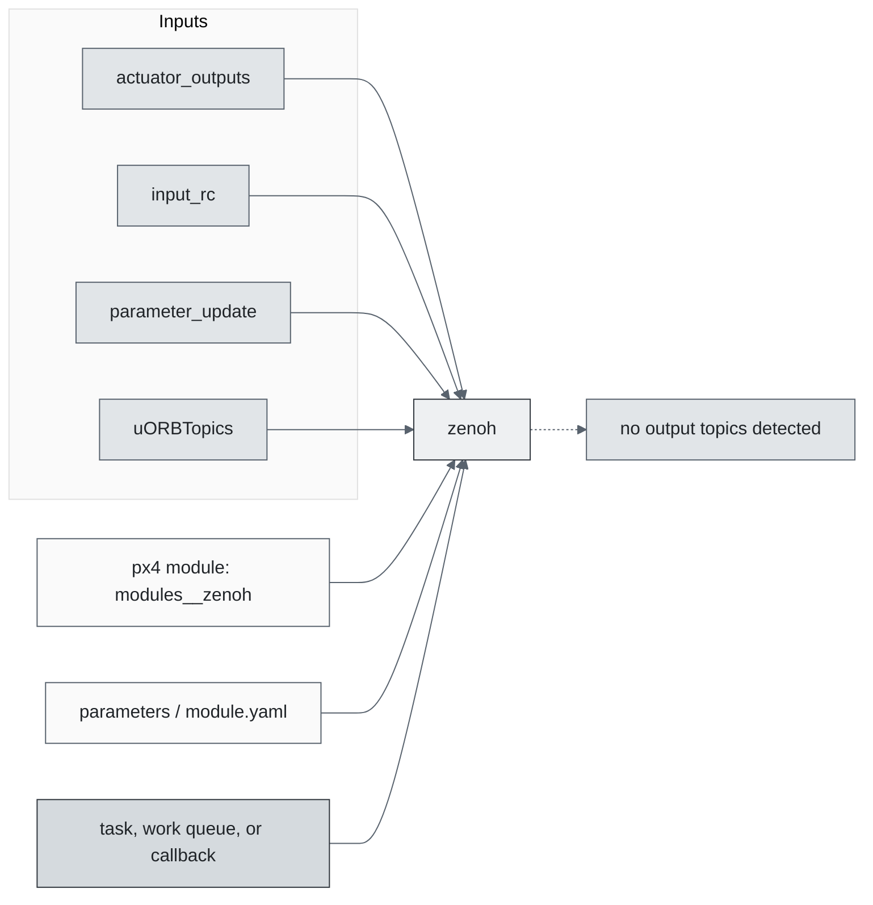
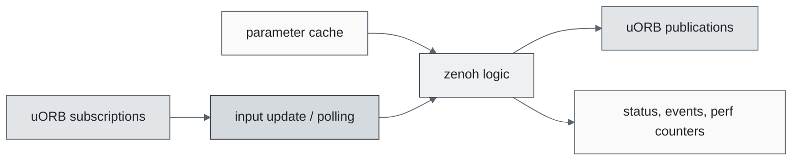
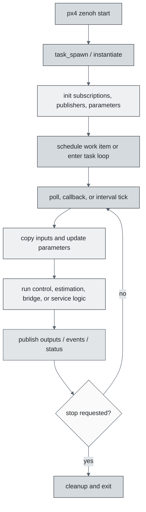
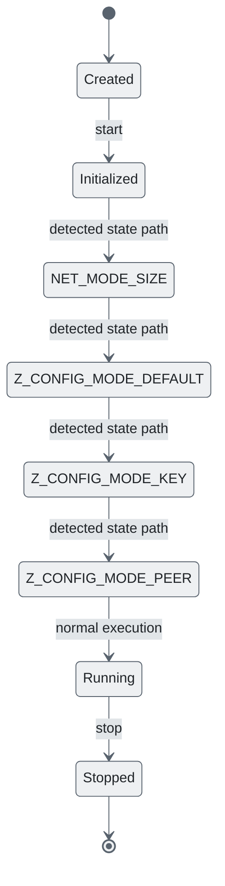
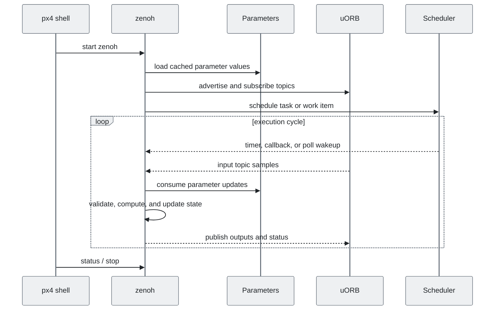
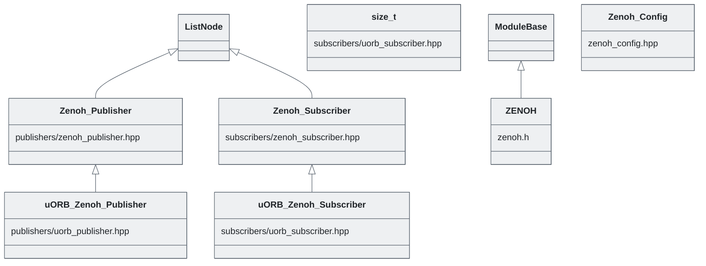

# PX4 Module Architecture: `zenoh`

- Source: `src/modules/zenoh`
- Build target: `modules__zenoh`
- Runtime main: `zenoh`
- Build kind: `px4 module`
- Mermaid palette: `slate` grey tone

Architecture notes for the Zenoh bridge module.

## Architecture Overview

This page is generated from the module source tree and shows the stable architecture surfaces: build entry point, scheduling shape, uORB data interfaces, parameter/configuration surfaces, and C++ types found in the module.

## Build and Entry Points

| Field | Value |
| --- | --- |
| Module path | src/modules/zenoh |
| Build kind | px4 module |
| Build target | modules__zenoh |
| Runtime main | zenoh |
| Stack main | Not specified |
| Module config | module.yaml |
| Detected sources | 4 |
| Detected headers | 7 |
| Detected configs | 4 |

### CMake Dependencies

- `cdr`
- `uorb_msgs`
- `px4_work_queue`
- `zenohpico_static`
- `zenoh_topics`
- `git_zenoh-pico`
- `default_topics_config`

### Nested Module Targets

- No nested module targets detected.

## Data Flow

### uORB Topics

| Topic | Detected direction |
| --- | --- |
| actuator_outputs | referenced |
| input_rc | referenced |
| parameter_update | referenced |
| uORBTopics | referenced |

## Execution Flow

The common PX4 module lifecycle is command entry, object construction or task spawn, parameter loading, topic setup, scheduled execution, publication, status reporting, and stop/cleanup. Modules that use `ModuleBase`, `ScheduledWorkItem`, polling loops, or bridge callbacks still fit this lifecycle with different scheduling triggers.

## State Machine

### Detected State-Like Symbols

- `NET_MODE_SIZE`
- `Z_CONFIG_MODE_DEFAULT`
- `Z_CONFIG_MODE_KEY`
- `Z_CONFIG_MODE_PEER`

## Sequence Diagram

## Class Diagram

### Detected Classes

| Class | Base | File |
| --- | --- | --- |
| uORB_Zenoh_Publisher | Zenoh_Publisher | publishers/uorb_publisher.hpp |
| Zenoh_Publisher | ListNode | publishers/zenoh_publisher.hpp |
| uORB_Zenoh_Subscriber | Zenoh_Subscriber | subscribers/uorb_subscriber.hpp |
| size_t |  | subscribers/uorb_subscriber.hpp |
| Zenoh_Subscriber | ListNode | subscribers/zenoh_subscriber.hpp |
| ZENOH | ModuleBase | zenoh.h |
| Zenoh_Config |  | zenoh_config.hpp |

### Detected Enums

- No enums detected.

## Parameters and Configuration

- `ZENOH_ENABLE`

## Source Map

| File | Kind |
| --- | --- |
| CMakeLists.txt | build |
| dds_topics.yaml | config |
| module.yaml | config |
| publishers/uorb_publisher.hpp | header |
| publishers/zenoh_publisher.cpp | source |
| publishers/zenoh_publisher.hpp | header |
| rmw_attachment.h | header |
| subscribers/uorb_subscriber.hpp | header |
| subscribers/zenoh_subscriber.cpp | source |
| subscribers/zenoh_subscriber.hpp | header |
| zenoh.cpp | source |
| zenoh.h | header |
| zenoh_config.cpp | source |
| zenoh_config.hpp | header |
| zenoh_params.yaml | config |

## Review Notes

- The diagrams are generated from static source inventory and should be used as a study map, not as a formal proof of every runtime branch.
- Topic direction is inferred from nearby source context such as `Subscription`, `Publication`, `orb_subscribe`, and `publish` usage.
- When a module has no explicit state enum, the state diagram shows the standard PX4 module lifecycle.
