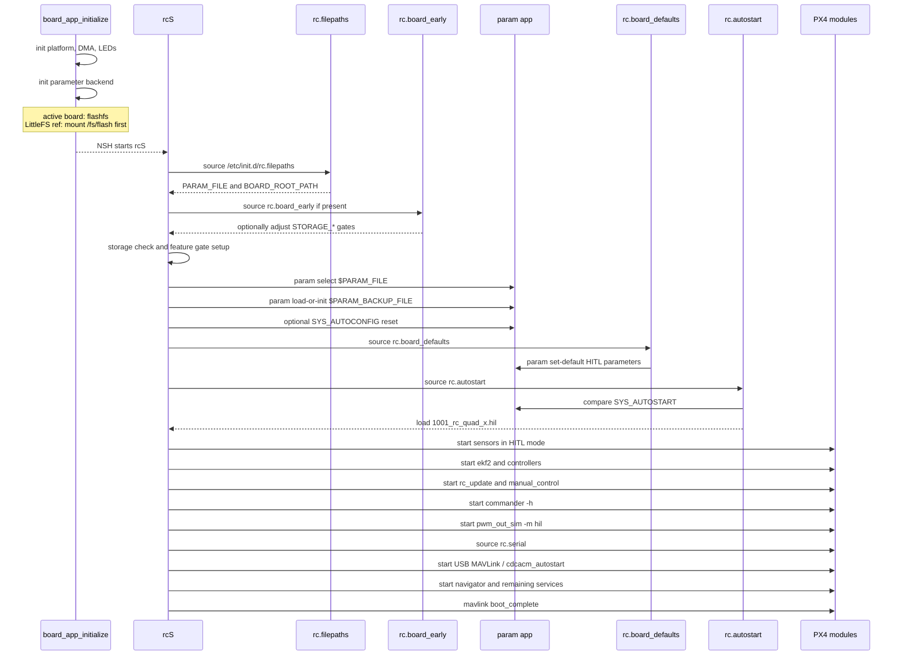

# Nucleo-H753ZI ROMFS Startup and Board Defaults Review

This document reviews the PX4 ROMFS startup path used by `boards/st/nucleo-h753zi`, with focus on how `rcS`, `rc.filepaths`, and `rc.board_defaults` interact for the no-sensor HITL board.

## Scope

Reviewed files:

| Area | File |
|---|---|
| Main startup script | `ROMFS/px4fmu_common/init.d/rcS` |
| Generated runtime file paths | `build/st_nucleo-h753zi_default/etc/init.d/rc.filepaths` |
| Board HITL defaults | `boards/st/nucleo-h753zi/init/rc.board_defaults` |
| Generated airframe lookup | `build/st_nucleo-h753zi_default/etc/init.d/rc.autostart` |
| Generated serial startup | `build/st_nucleo-h753zi_default/etc/init.d/rc.serial` |
| LittleFS reference startup hook | `boards/st/nucleo-h753zi/littlefs_ref/init/rc.board_early` |

## Current Runtime Summary

The active board currently uses raw flashfs parameter storage:

```sh
set PARAM_FILE /fs/mtd_params
set BOARD_ROOT_PATH /fs/microsd
```

Those values are generated into `build/st_nucleo-h753zi_default/etc/init.d/rc.filepaths`.

Because the active board still defines `FLASH_BASED_PARAMS`, the `param` app uses the flash backend. In this mode `param select $PARAM_FILE` does not switch storage to a normal file; the selected path is effectively ignored for default parameter persistence.

For a LittleFS parameter backend, `FLASH_BASED_PARAMS` must be removed and `CONFIG_BOARD_PARAM_FILE` must point to a real mounted file such as:

```sh
CONFIG_BOARD_PARAM_FILE="/fs/flash/params"
```

## Startup Sequence



## rcS Ordering Review

| Order | Step | Why it matters |
|---:|---|---|
| 1 | `rcS` sources `rc.filepaths` | Defines `PARAM_FILE` and `BOARD_ROOT_PATH`. |
| 2 | Optional `rc.board_early` | The only board hook that runs before storage checks and parameter load. |
| 3 | Storage check | Enables backup/log/external-airframe behavior when storage is detected. |
| 4 | `param select $PARAM_FILE` | Selects file-backed parameter storage when flash backend is not compiled. |
| 5 | `param load-or-init` | Loads saved params or seeds defaults on first boot. |
| 6 | `rc.board_defaults` | Applies board defaults after saved params are loaded. |
| 7 | `rc.autostart` | Uses `SYS_AUTOSTART` to load the matching airframe script. |
| 8 | HITL branch | `SYS_HITL > 0` starts HIL sensors, `commander -h`, and simulated outputs. |
| 9 | `rc.serial` and USB autostart | Starts configured serial/MAVLink links and USB MAVLink. |
| 10 | `mavlink boot_complete` | Announces the system finished startup. |

## rc.board_defaults Review

Current board defaults:

| Group | Parameters | Review |
|---|---|---|
| Airframe and HITL | `SYS_AUTOSTART=1001`, `SYS_HITL=1` | Correct for classical MAVLink HITL with the generic quadrotor HIL airframe. |
| Sensor presence | `SYS_HAS_MAG=1`, `SYS_HAS_BARO=1`, `SYS_HAS_GPS=1` | Correct for this board because jMAVSim or another HITL simulator supplies mag, GPS, and baro over MAVLink. |
| EKF aiding | `EKF2_GPS_CTRL=7`, `EKF2_HGT_REF=1`, `EKF2_BARO_CTRL=1`, `EKF2_MAG_TYPE=6`, `EKF2_MAG_CHECK=0`, `EKF2_EV_CTRL=0`, `SENS_IMU_MODE=0`, `EKF2_MULTI_IMU=3` | Uses HIL GPS/baro for position and height, uses the HIL magnetometer only to initialize heading, and matches the PX4 MAVLink simulator EKF/IMU routing defaults. |
| Simulator tolerance | `EKF2_REQ_*`, `EKF2_DELAY_MAX` | Helps avoid startup transients blocking estimator readiness. |
| Arming and IO | `COM_ARM_WO_GPS=1`, `COM_ARM_MAG_STR=0`, `CBRK_SUPPLY_CHK=894281`, `CBRK_IO_SAFETY=220127`, `COM_RC_IN_MODE=4`, `COM_DISARM_PRFLT=-1` | Correct for bench HITL, but intentionally not flight-safe. |
| USB MAVLink | `GPS_1_CONFIG=0`, `GPS_2_CONFIG=0`, `RC_PORT_CONFIG=0`, `MAV_0_CONFIG=0`, `MAV_1_CONFIG=0`, `MAV_2_CONFIG=0`, `SYS_USB_AUTO=2`, `USB_MAV_MODE=2` | Keeps CN13 User USB owned by `cdcacm_autostart` for MAVLink HITL/QGC traffic. |

`rc.board_defaults` uses `param set-default`, so saved user parameters can still override these defaults. This is the right behavior for a board default file.

## Active Flashfs Notes

The active implementation stores parameters in internal flash through `parameter_flashfs_init()` in board initialization.

Implications:

- `param select $PARAM_FILE` does not control the backend while `FLASH_BASED_PARAMS` is enabled.
- `/fs/mtd_params` is not expected to appear as a normal file.
- The current `BOARD_ROOT_PATH=/fs/microsd` is harmless for this no-SD board because no storage is detected.

## LittleFS Reference Notes

For file-backed LittleFS parameters:

1. Remove `FLASH_BASED_PARAMS`.
2. Mount the LittleFS volume before `rcS` reaches `param select`.
3. Set `CONFIG_BOARD_PARAM_FILE="/fs/flash/params"`.
4. Prefer leaving `CONFIG_BOARD_ROOT_PATH` as `/fs/microsd` unless `/fs/flash` is intentionally general board storage.

Do not set `CONFIG_BOARD_ROOT_PATH="/fs/flash"` for a tiny parameter-only LittleFS volume unless you also want `rcS` to look there for:

- `etc/rc.txt`
- `etc/config.txt`
- `etc/extras.txt`
- parameter backups
- hardfault logs
- external airframes
- update directories

The `littlefs_ref/init/rc.board_early` file disables storage-related feature gates, but keeping `BOARD_ROOT_PATH` separate from the parameter file path is cleaner.

## Action List

| Priority | Action | Reason |
|---:|---|---|
| 1 | Keep the active `rc.board_defaults` as the source of truth for HITL. | It matches the no-sensor board and enables HIL magnetometer heading initialization. |
| 2 | For LittleFS, set only `CONFIG_BOARD_PARAM_FILE="/fs/flash/params"` and avoid setting `CONFIG_BOARD_ROOT_PATH="/fs/flash"` unless needed. | Prevents the small parameter volume from becoming general board storage. |
| 3 | Keep or add `rc.board_early` for LittleFS to disable storage backups/logging on the parameter partition. | Avoids filling the LittleFS partition with non-parameter files. |
| 4 | After any LittleFS change, inspect generated `rc.filepaths`. | It must show the intended `PARAM_FILE`. |
| 5 | Verify parameter persistence after boot. | Confirms `param select`, `param load-or-init`, and `param save` are using the intended backend. |
| 6 | Update docs to state that `SYS_HAS_GPS=1` and `SYS_HAS_BARO=1` mean HIL-provided GPS/baro are required. | Avoids confusion with physical sensors. |
| 7 | Optionally remove physical GPS/RC modules if flash pressure increases. | HITL disables physical GPS and ignores RC input via `COM_RC_IN_MODE=4`. |

## Validation Commands

After rebuilding:

```sh
cat build/st_nucleo-h753zi_default/etc/init.d/rc.filepaths
cat build/st_nucleo-h753zi_default/etc/init.d/rc.board_defaults
```

On the board:

```sh
param status
param show SYS_AUTOSTART
param show SYS_HITL
param show COM_DISARM_PRFLT
commander check
```

For LittleFS:

```sh
ls /fs/flash
param set COM_DISARM_PRFLT -1
param save
reboot
param show COM_DISARM_PRFLT
ls /fs/flash
```
