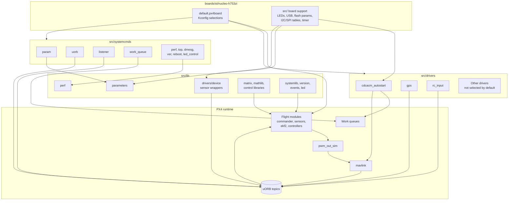
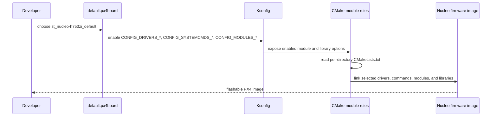
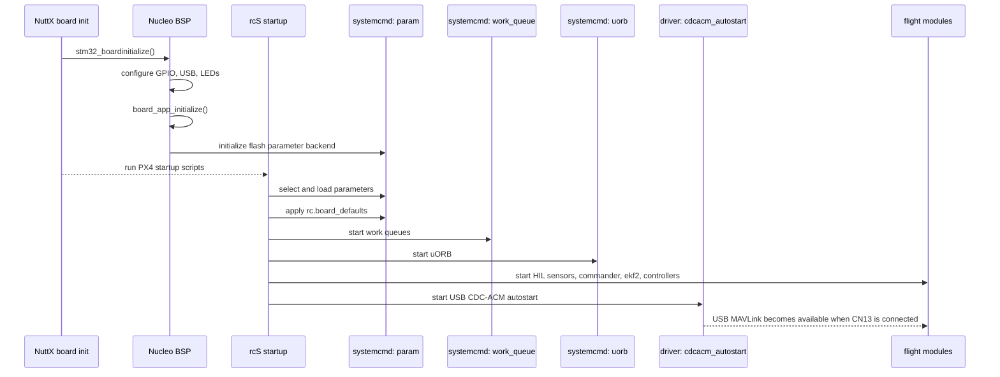
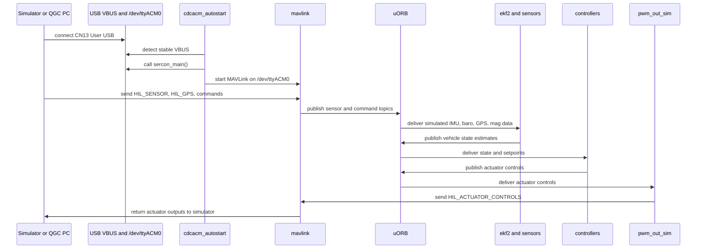
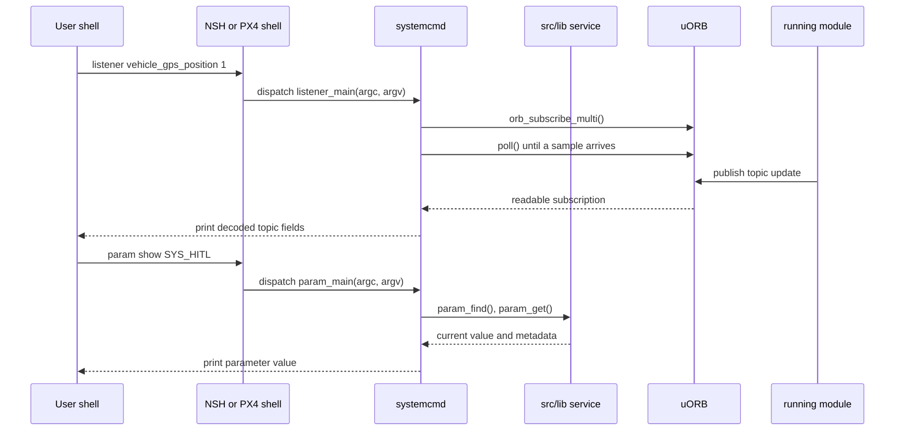
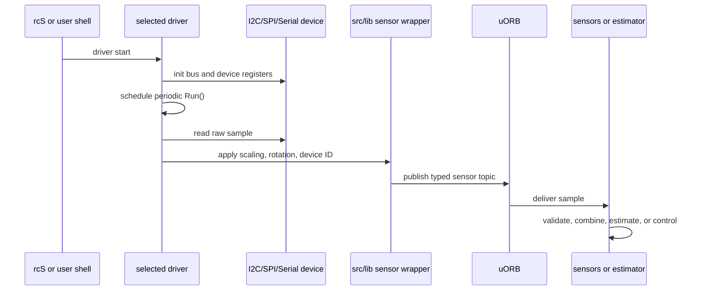

# PX4 Source Subsystems Architecture for Nucleo-H753ZI

This document describes how `src/drivers`, `src/systemcmds`, and `src/lib` fit into the PX4 firmware built for `boards/st/nucleo-h753zi`.

The Nucleo-H753ZI target is a minimal STM32H753 board support package for Hardware-In-the-Loop simulation. It has USB, two serial ports, LEDs, flash-backed parameters, SPI3 exposed on the Arduino header, and I2C1 pins exposed on the Arduino header. No physical flight sensors are populated in the default configuration, so most sensor data enters through MAVLink HIL messages and is then published on uORB.

## Reviewed Source Scope

| Area | Source paths |
|---|---|
| Board build selection | `boards/st/nucleo-h753zi/default.px4board` |
| Board support layer | `boards/st/nucleo-h753zi/src/*` |
| Drivers | `src/drivers/*` |
| System commands | `src/systemcmds/*` |
| Shared libraries | `src/lib/*` |
| Runtime module interface | `platforms/common/include/px4_platform_common/module.h` |

## Board-Specific Build Selection

`default.px4board` selects the runtime modules that are compiled into this target. For the requested source areas, the board enables this subset:

| Source tree | Enabled entries for this board | Runtime role |
|---|---|---|
| `src/drivers` | `cdcacm_autostart`, `gps`, `rc_input` | USB CDC-ACM MAVLink autostart, optional physical GPS, optional RC input |
| `src/systemcmds` | `dmesg`, `led_control`, `mft`, `mft_cfg`, `mklittlefs`, `mtd`, `nshterm`, `param`, `perf`, `reboot`, `top`, `topic_listener`, `uorb`, `ver`, `work_queue` | Shell tools for boot scripts, diagnostics, parameter storage, uORB inspection, system monitoring, and reboot |
| `src/lib` | Selected by dependencies and Kconfig | Common code used by drivers, modules, board support, parameters, uORB, math/control code, and diagnostics |

Important board defaults:

| Board property | Value |
|---|---|
| Architecture | Cortex-M7, STM32H753ZI |
| Primary HIL transport | USB CDC-ACM on `/dev/ttyACM0` |
| Console | USART3 through ST-LINK virtual COM |
| Physical sensors | None in the default board configuration |
| Parameter backend | Internal flash, via `FLASH_BASED_PARAMS` |
| I2C bus table | Empty in `src/i2c.cpp` |
| SPI bus table | SPI3 present, no default devices in `src/spi.cpp` |
| Direct PWM outputs | `DIRECT_PWM_OUTPUT_CHANNELS=0`; HIL uses `pwm_out_sim` |

## Source Tree Roles

### `src/drivers`

`src/drivers` contains runtime modules that interface with hardware, simulated endpoints, or board-level transport devices. A typical driver has:

- A per-driver `CMakeLists.txt` using `px4_add_module(MAIN <command>)` or a library target.
- A `Kconfig` option selected by the board configuration.
- A module entry point named `<command>_main`.
- A PX4 module class based on `ModuleBase`, often also using `ModuleParams` and `px4::ScheduledWorkItem`.
- uORB publications for produced data and uORB subscriptions for control, parameters, or state.
- Optional `module.yaml` or `params.yaml` metadata.

For Nucleo-H753ZI:

| Driver | Primary interface | Notes |
|---|---|---|
| `cdcacm_autostart` | USB VBUS sense, `/dev/ttyACM0`, `exec_builtin("mavlink", ...)`, `actuator_armed` subscription | Starts or stops USB MAVLink when the User USB cable is connected and the vehicle is not armed. |
| `gps` | UART or SPI device, parser helpers under `src/drivers/gps/devices`, uORB `sensor_gps` and `sensor_gnss_relative` publications | Built for optional real GPS, but board defaults set `GPS_1_CONFIG=0` for HIL. |
| `rc_input` | Serial RC protocols, optional PPM, uORB `input_rc` publication | Built for optional RC input, but board defaults set `COM_RC_IN_MODE=4` for joystick or no manual RC requirement in HITL. |

Most other drivers in the tree are available to other PX4 boards but are not compiled into this minimal target unless the board file is changed.

### `src/systemcmds`

`src/systemcmds` contains shell commands and diagnostics that run from NSH, PX4 shell over MAVLink, startup scripts, or developer consoles. These commands use the same PX4 module registration mechanism as drivers, but most are short-lived command handlers instead of long-running hardware loops.

For Nucleo-H753ZI, the most important commands are:

| Command | Interface | Use on this board |
|---|---|---|
| `param` | Parameter API in `src/lib/parameters` | Startup defaults, flash-backed parameter load/save, inspection from NSH/QGC shell. |
| `uorb` | uORB core API | Starts or inspects the internal pub-sub system. |
| `listener` | uORB subscription and `poll()` | Prints live topic samples such as `sensor_accel`, `vehicle_gps_position`, and `actuator_outputs`. |
| `work_queue` | `px4::WorkQueueManager` | Starts and reports work queues used by scheduled modules such as `cdcacm_autostart`. |
| `perf` | `src/lib/perf` | Prints performance counters for loops and latency. |
| `top` | OS task inspection | Reports task CPU and stack usage. |
| `dmesg` | Console/log buffer | Reads boot and runtime log output. |
| `mtd`, `mklittlefs` | MTD and filesystem utilities | Useful for storage experiments; active parameters use raw flashfs. |
| `led_control` | LED command path | Exercises the board LEDs. |
| `ver` | Version library and board metadata | Prints firmware, board, and build version information. |

### `src/lib`

`src/lib` is the reusable runtime layer. Libraries are added with `add_subdirectory(... EXCLUDE_FROM_ALL)` and then pulled into the firmware by module dependencies, board support, or Kconfig selections.

Representative library groups:

| Library group | Examples | Role |
|---|---|---|
| Driver support | `lib/drivers/device`, `lib/drivers/accelerometer`, `lib/drivers/gyroscope`, `lib/drivers/barometer`, `lib/drivers/rangefinder`, `cdev` | Common device IDs, sensor publication wrappers, character-device support, and bus abstractions. |
| Runtime services | `parameters`, `perf`, `systemlib`, `events`, `version`, `led`, `button` | Parameters, counters, logging support, event publishing, version reporting, and board/service utilities. |
| Math and control | `matrix`, `mathlib`, `controllib`, `pid`, `rate_control`, `control_allocation`, `mixer_module` | Common algorithms shared by estimators, controllers, and actuator paths. |
| Vehicle and environment models | `geo`, `atmosphere`, `airspeed`, `battery`, `world_magnetic_model`, `wind_estimator` | Physical conversions and models used by modules. |
| Protocols and parsers | `rc`, `gnss`, `cdrstream`, `tinybson`, `tunes`, `crc` | Data parsing, serialization, checksums, and signaling formats. |

## Runtime Architecture

## Interface Map

| Interface | Defined or used by | Purpose |
|---|---|---|
| PX4 module entry point | `px4_add_module(MAIN ...)`, `<name>_main`, `ModuleBase::Descriptor` | Exposes commands such as `gps start`, `param show`, `work_queue status`, and `uorb top`. |
| Module lifecycle | `ModuleBase::main`, `start_command`, `stop_command`, `status_command`, `print_status()` | Standardizes start, stop, status, and cleanup across long-running modules. |
| Work queue scheduling | `px4::ScheduledWorkItem`, `px4::WorkQueueManager` | Runs periodic or event-driven module work without each module owning a dedicated task. |
| uORB publish/subscribe | `uORB::Publication`, `uORB::PublicationMulti`, `uORB::Subscription`, `orb_subscribe`, `poll()` | Moves sensor, state, setpoint, command, and diagnostic data between modules. |
| Parameter API | `param_find`, `param_get`, `param_set`, `param_set_default_file`, `ModuleParams` | Provides typed runtime configuration and board defaults. |
| Device abstraction | `device::Device::init/read/write/ioctl`, device ID encoding | Gives I2C, SPI, serial, MAVLink, UAVCAN, and simulation devices a common identity model. |
| Sensor wrappers | `PX4Accelerometer`, `PX4Gyroscope`, `PX4Barometer`, `PX4Magnetometer`, `PX4Rangefinder` | Convert driver samples into typed uORB sensor topics with device IDs, scaling, and metadata. |
| Perf counters | `perf_alloc`, `perf_begin`, `perf_end`, `perf_count`, `perf_print_all` | Measures loop duration, intervals, counts, and latency. |
| OS and file APIs | `px4_open`, `px4_close`, `poll`, NuttX `/dev/*`, MTD flash | Connects modules to serial ports, USB, device nodes, and storage. |

## Build and Selection Flow

`src/drivers/Kconfig` and `src/systemcmds/Kconfig` recursively include child Kconfig files with `rsource "*/Kconfig"`. Individual driver and command directories own their build rules. `src/lib/CMakeLists.txt` lists reusable library directories with `EXCLUDE_FROM_ALL`; they enter the firmware when selected or linked by another target.

## Boot-Time Runtime Sequence

This target boots through board initialization, then PX4 startup scripts start the selected command and module set. The exact script ordering is documented in `rc_startup_sequence.md`; this diagram focuses on the requested source trees.

## USB HIL Data Sequence

With `SYS_USB_AUTO=2`, `cdcacm_autostart` starts MAVLink on `/dev/ttyACM0` after User USB VBUS is stable. HIL sensor data then enters PX4 through MAVLink and becomes normal uORB data for the estimator and controllers.

## System Command Inspection Sequence

System commands provide the primary interactive interface for this board through the ST-LINK NSH console or the QGroundControl MAVLink shell.

## Generic Driver Publication Sequence

The default Nucleo build has no physical sensor devices, but any future board extension follows the normal PX4 driver path:

## Adding a Driver or Command to This Board

To add a source tree entry to Nucleo-H753ZI:

1. Ensure the driver or command has a `Kconfig` entry and `CMakeLists.txt`.
2. Enable the corresponding `CONFIG_DRIVERS_*` or `CONFIG_SYSTEMCMDS_*` option in `boards/st/nucleo-h753zi/default.px4board`.
3. If the module needs a physical bus device, update `boards/st/nucleo-h753zi/src/i2c.cpp` or `boards/st/nucleo-h753zi/src/spi.cpp`.
4. Add board defaults in `boards/st/nucleo-h753zi/init/rc.board_defaults` only when the setting is board-specific.
5. Rebuild with `make st_nucleo-h753zi_default`.
6. On target, validate with `ver`, `top`, `work_queue status`, `uorb top`, `listener <topic>`, `param status`, and the module's own `status` command.

## Practical Debug Commands

| Goal | Command |
|---|---|
| Check compiled version and board metadata | `ver all` |
| Check parameters and backend state | `param status` |
| Inspect board defaults | `param show SYS_HITL`, `param show SYS_USB_AUTO`, `param show GPS_1_CONFIG` |
| See topic rates | `uorb top` |
| Print one topic sample | `listener sensor_accel 1`, `listener vehicle_gps_position 1` |
| Check work queues | `work_queue status` |
| Check CPU and stack | `top` |
| Check performance counters | `perf` |
| Read boot/runtime log buffer | `dmesg` |
| Reboot target | `reboot` |

## Nucleo-H753ZI Design Notes

- `cdcacm_autostart` is the most board-relevant driver in the default build because it owns automatic MAVLink startup over User USB.
- The `gps` and `rc_input` drivers are compiled but normally inactive or ignored in the default HIL setup.
- HIL topics are normal uORB topics after MAVLink receives and translates them, so estimator and controller modules do not need board-specific HIL interfaces.
- The board has no direct PWM outputs; actuator output is represented by `pwm_out_sim`.
- Flash parameters are initialized in board startup through `parameter_flashfs_init()` and are not visible as normal files in `ls`.
- Adding real I2C or SPI devices requires both enabling the driver and populating the board bus table with the device definition.
