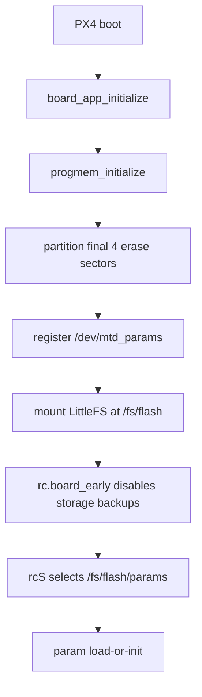

# Nucleo-H753ZI LittleFS Parameter Storage Reference

This directory is a reference implementation for replacing the current raw
flashfs parameter backend with file-backed PX4 parameters stored on a LittleFS
volume in the final internal flash sectors.

The active board files are not modified by this directory. Use these files as
copy/reference material when you are ready to replace the current
implementation.

## Flash Layout

This reference reserves the last four STM32H753 flash sectors for LittleFS:

| Region | Sectors | Address range | Size |
|---|---:|---|---:|
| Bootloader | 0 | `0x08000000` - `0x0801ffff` | 128 KiB |
| PX4 app | 1-11 | `0x08020000` - `0x0817ffff` | 1408 KiB |
| LittleFS params | 12-15 | `0x08180000` - `0x081fffff` | 512 KiB |

Why four sectors:

- LittleFS needs a metadata block pair.
- PX4 parameters are stored as a BSON file and can exceed the LittleFS inline
  file size.
- One additional erase block gives copy-on-write updates room to complete.
- `rc.board_early` disables generic storage backups, so this small filesystem
  is used only for `/fs/flash/params`.

If you need more app flash, three sectors might build, but it leaves less
LittleFS update headroom. If you need exactly one 128 KiB sector, keep flashfs.

The current HITL-focused image was previously around 1.396 MiB, so the 1408 KiB
application limit is tight. If this reference build exceeds the limit, trim
unused modules first, especially physical GPS/RC paths or optional SIH support.

## Files to Replace or Merge

Full replacement references:

| Reference file | Target file |
|---|---|
| `default.px4board` | `boards/st/nucleo-h753zi/default.px4board` |
| `firmware.prototype` | `boards/st/nucleo-h753zi/firmware.prototype` |
| `src/init.c` | `boards/st/nucleo-h753zi/src/init.c` |
| `src/board_config.h` | `boards/st/nucleo-h753zi/src/board_config.h` |
| `src/hw_config.h` | `boards/st/nucleo-h753zi/src/hw_config.h` |
| `init/rc.board_early` | `boards/st/nucleo-h753zi/init/rc.board_early` |

Focused merge fragments:

| Reference fragment | Target file |
|---|---|
| `nuttx-config/scripts/script.ld.fragment` | `boards/st/nucleo-h753zi/nuttx-config/scripts/script.ld` |
| `nuttx-config/nsh/defconfig.fragment` | `boards/st/nucleo-h753zi/nuttx-config/nsh/defconfig` |

## Runtime Flow



## Validation

Build:

```sh
timeout 180 make st_nucleo-h753zi_default
```

Boot checks from NSH:

```sh
dmesg
ls /fs
ls /fs/flash
param status
```

Parameter persistence:

```sh
param set COM_DISARM_PRFLT -1
param save
reboot
param show COM_DISARM_PRFLT
ls /fs/flash
```

Expected files:

```text
/fs/flash/params
```

`parameters_backup.bson` should not be created because `rc.board_early`
disables generic storage handling for this tiny internal filesystem.

## Notes

- The first LittleFS boot formats sectors 12-15. Existing flashfs parameter
  data in sector 15 is erased.
- `CONFIG_FS_LITTLEFS_BLOCK_CYCLE=-1` is used because this is a tiny
  dedicated filesystem. Metadata relocation needs spare erase blocks that this
  layout intentionally does not provide.
- Do not use `/fs/flash` for logs, missions, or large files unless you reserve
  more flash sectors and revisit the app image limit.
