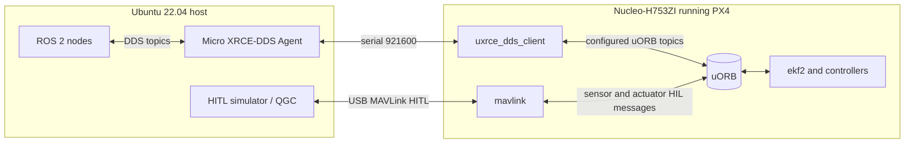

# Board Integration

This document describes the firmware-side ROS 2 / DDS integration for the
ST Nucleo-H753ZI PX4 board support.

## Architecture



The board uses two independent host links:

- USB CN13 remains dedicated to MAVLink HITL and QGroundControl.
- USART6 on CN10 D0/D1 is dedicated to uXRCE-DDS.

Do not try to share the same serial port between MAVLink and uXRCE-DDS.

## Firmware Configuration

In this checkout, `boards/st/nucleo-h753zi/default.px4board` already enables:

```text
CONFIG_MODULES_UXRCE_DDS_CLIENT=y
```

If you are carrying this reference to another branch, verify that line is still
present before building.

Build and flash:

```sh
make st_nucleo-h753zi_default
make st_nucleo-h753zi_default upload
```

## Startup Options

### Manual start

Use this first while debugging the serial wiring:

```text
nsh> uxrce_dds_client start -t serial -d /dev/ttyS1 -b 921600
nsh> uxrce_dds_client status
```

The matching host command is:

```sh
MicroXRCEAgent serial --dev /dev/ttyUSB0 -b 921600
```

### Boot-time start

Copy the reference startup hook into the board init directory:

```sh
cp boards/st/nucleo-h753zi/ros2_ref/config/rc.board_extras \
   boards/st/nucleo-h753zi/init/rc.board_extras
```

Rebuild and flash. PX4 copies `init/rc.board_extras` into ROMFS and sources it
late in `rcS`, after normal board defaults, airframe setup, and core modules
have started.

The reference startup hook:

- Keeps `UXRCE_DDS_DOM_ID=0`, matching the ROS 2 default domain.
- Keeps `UXRCE_DDS_KEY=1`, suitable for a single board and single agent.
- Enables bridge timestamp synchronization.
- Starts `uxrce_dds_client` on `/dev/ttyS1` at `921600`.

## Wiring

| Nucleo header | MCU pin | Signal | USB-UART adapter |
|---|---|---|---|
| CN10 D0 | PG9 | USART6 RX | TX |
| CN10 D1 | PG14 | USART6 TX | RX |
| GND | GND | Ground | GND |

Use a short ground-connected cable and a 3.3 V adapter. If the agent never
shows a session, swap TX/RX and verify that the adapter is not configured for
5 V logic.

## DDS Topics

PX4 generates the board-side DDS client from:

```text
src/modules/uxrce_dds_client/dds_topics.yaml
```

Common output topics in this checkout include:

| Direction | Topic | ROS 2 type |
|---|---|---|
| PX4 to ROS 2 | `/fmu/out/vehicle_status` | `px4_msgs/msg/VehicleStatus` |
| PX4 to ROS 2 | `/fmu/out/vehicle_odometry` | `px4_msgs/msg/VehicleOdometry` |
| PX4 to ROS 2 | `/fmu/out/vehicle_attitude` | `px4_msgs/msg/VehicleAttitude` |
| PX4 to ROS 2 | `/fmu/out/sensor_combined` | `px4_msgs/msg/SensorCombined` |
| PX4 to ROS 2 | `/fmu/out/timesync_status` | `px4_msgs/msg/TimesyncStatus` |
| ROS 2 to PX4 | `/fmu/in/onboard_computer_status` | `px4_msgs/msg/OnboardComputerStatus` |
| ROS 2 to PX4 | `/fmu/in/offboard_control_mode` | `px4_msgs/msg/OffboardControlMode` |
| ROS 2 to PX4 | `/fmu/in/trajectory_setpoint` | `px4_msgs/msg/TrajectorySetpoint` |
| ROS 2 to PX4 | `/fmu/in/vehicle_command` | `px4_msgs/msg/VehicleCommand` |

The reference node uses only `OnboardComputerStatus` for ROS 2 to PX4 traffic.
That topic verifies the inbound DDS path without changing flight mode, arming,
or actuator outputs.

## Namespaces

The default configuration publishes topics without a vehicle namespace:

```text
/fmu/out/vehicle_status
/fmu/in/onboard_computer_status
```

For multi-vehicle work, start the PX4 client with `-n uav_0` or set
`UXRCE_DDS_NS_IDX` to generate namespaced topics such as:

```text
/uav_0/fmu/out/vehicle_status
/uav_0/fmu/in/onboard_computer_status
```

The reference node accepts a `px4_namespace` parameter for this case.

