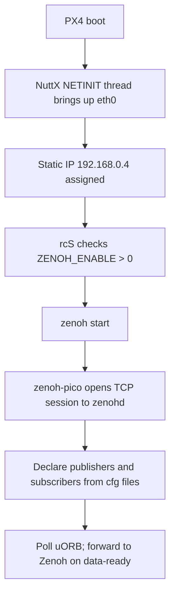

# Nucleo-H753ZI Zenoh Integration Reference

This directory is a reference implementation for enabling Zenoh on the
Nucleo-H753ZI board via its on-board Ethernet port.

The active board files are not modified by this directory. Use these files as
copy/merge material when you are ready to add Zenoh to a build.

---

## Overview

Zenoh replaces the uXRCE-DDS + micro-ROS Agent path with a single protocol
that runs directly between PX4 and ROS 2 (or any Zenoh application) over
Ethernet. The `zenoh` PX4 module (powered by
[zenoh-pico](https://github.com/eclipse-zenoh/zenoh-pico)) bridges internal
uORB topics to the Zenoh wire format, using the same CDR serialisation and key
expression layout as
[rmw_zenoh_cpp](https://github.com/ros2/rmw_zenoh), so ROS 2 nodes discover
PX4 topics natively without a separate bridge process.

```
         PX4 (Nucleo-H753ZI)                     Host (Linux / ROS 2)
┌────────────────────────────────┐          ┌───────────────────────────────┐
│  uORB bus                      │          │  zenohd  (Zenoh router)       │
│   sensor_combined ──┐          │          │     │                         │
│   vehicle_attitude ─┤          │          │     │ TCP  port 7447           │
│   vehicle_status   ─┤ zenoh    │  Ethernet│     │                         │
│   ...              ─┤ module ──┼──────────┼─────┘                         │
│                     │(pub/sub) │          │  ROS 2 node (rmw_zenoh_cpp)   │
│   trajectory_sp ◄───┤          │          │   ros2 topic echo /fmu/out/…  │
│   vehicle_command◄──┘          │          └───────────────────────────────┘
└────────────────────────────────┘
```

Key properties:

- **No bridge process** needed on the host when using `rmw_zenoh_cpp`.
- **ROS 2 Jazzy+** compatible when `CONFIG_ZENOH_KEY_TYPE_HASH=y` (the
  default); disable it for Humble/Iron.
- Topics and QoS are configured at runtime via NSH — no rebuild required.
- The zenoh-pico library is bundled at
  `src/modules/zenoh/zenoh-pico/`.

---

## Hardware Requirements

| Item | Detail |
|---|---|
| Board | ST Nucleo-H753ZI (Nucleo-144, STM32H753ZI) |
| Ethernet PHY | LAN8742A — present on CN1 (RJ-45 connector, top-right of board) |
| Cable | Standard RJ-45 patch cable to a switch or directly to the host |
| Host | Linux PC with `zenohd` **or** ROS 2 Jazzy with `rmw_zenoh_cpp` |

> The Nucleo-144 Ethernet connector is wired to the STM32H7's built-in MAC
> (`STM32H7_ETHMAC`) through the on-board LAN8742A PHY.  The current
> `default.px4board` build does **not** enable the NuttX network stack, so
> both a new `.px4board` variant and a `defconfig` merge are required.

---

## Files to Replace or Merge

| Reference file | Target location | Action |
|---|---|---|
| `zenoh.px4board` | `boards/st/nucleo-h753zi/zenoh.px4board` | **Create** (new variant) |
| `nuttx-config/nsh/defconfig.fragment` | `boards/st/nucleo-h753zi/nuttx-config/nsh/defconfig` | **Merge** (append lines) |
| `init/rc.board_zenoh` | `boards/st/nucleo-h753zi/init/rc.board_zenoh` | **Create** (optional, see below) |

---

## NuttX Network Stack (`defconfig.fragment`)

The current `nuttx-config/nsh/defconfig` has no networking entries. The
fragment adds:

| Config key | Purpose |
|---|---|
| `CONFIG_STM32H7_ETHMAC=y` | Enable the STM32H7 Ethernet MAC driver |
| `CONFIG_ETH0_PHY_LAN8742A=y` | Select the LAN8742A PHY |
| `CONFIG_NET_TCP=y` / `CONFIG_NET_UDP=y` | TCP and UDP sockets for zenoh-pico |
| `CONFIG_NET_TCP_WRITE_BUFFERS=y` / `CONFIG_NET_UDP_WRITE_BUFFERS=y` | Async TX (required by zenoh-pico) |
| `CONFIG_NETINIT_THREAD=y` | Bring up `eth0` automatically at boot |
| `CONFIG_NETINIT_IPADDR=0xC0A80004` | Static IP 192.168.0.4 (change as needed) |
| `CONFIG_NETINIT_DRIPADDR=0xC0A80001` | Default gateway 192.168.0.1 |
| `CONFIG_SYSTEM_DHCPC_RENEW=y` | DHCP client renewal support |
| `CONFIG_NET_ICMP=y` / `CONFIG_NET_ICMP_SOCKET=y` | `ping` connectivity testing |

To use DHCP instead of a static address, add `CONFIG_NETINIT_DHCPC=y` and
remove the three `CONFIG_NETINIT_*IPADDR` lines before merging.

### Merge procedure

```sh
# From the repo root — append the fragment to the existing defconfig,
# then run menuconfig + savedefconfig to let NuttX normalise it.
cat boards/st/nucleo-h753zi/zenoh_ref/nuttx-config/nsh/defconfig.fragment \
    >> boards/st/nucleo-h753zi/nuttx-config/nsh/defconfig

make st_nucleo-h753zi_zenoh menuconfig   # optional: review/adjust
make st_nucleo-h753zi_zenoh savedefconfig
```

---

## Build

```sh
# From the repo root
make st_nucleo-h753zi_zenoh
```

The `zenoh` variant overlays `default.px4board` with:
- `CONFIG_BOARD_ETHERNET=y` — tells the PX4 build system to link network init
- `CONFIG_MODULES_ZENOH=y` — includes the zenoh module
- `CONFIG_MODULES_UXRCE_DDS_CLIENT=n` — disables uXRCE-DDS (incompatible with Zenoh)
- `CONFIG_ZENOH_PUB_OPTION_OVERRIDE=y` — enables per-publisher QoS overrides

Flash with:

```sh
make st_nucleo-h753zi_zenoh upload
# or use an ST-Link programmer:
make st_nucleo-h753zi_zenoh upload UPLOADER=openocd
```

---

## Runtime Configuration

Zenoh is configured via NSH at runtime. Settings persist to the flash
filesystem. You do not need to rebuild after changing topics or the network
locator.

### 1  Set parameters and enable Zenoh

Connect over USB CDC (`/dev/ttyACM0`) and run from NSH:

```sh
# Apply Zenoh parameter defaults (or run the provided script):
sh /etc/init.d/rc.board_zenoh

# Verify Ethernet link (should show inet addr 192.168.0.4):
ifconfig

# Test connectivity to the Zenoh router host (replace with your host IP):
ping 192.168.0.1
```

### 2  Configure the network locator

```sh
# Client mode — connect to a running zenohd on the host
zenoh config net client tcp/192.168.0.1:7447#iface=eth0

# Peer mode — multicast peer discovery on the local segment
zenoh config net peer udp/224.0.0.224:7446#iface=eth0
```

The locator is stored in `/fs/mtd_params/zenoh/net.cfg` and read at every
`zenoh start`.

### 3  Add publisher and subscriber topic mappings

Publishers forward uORB → Zenoh. Subscribers receive Zenoh → uORB.

```sh
# Add a publisher (uORB sensor_combined → Zenoh /fmu/out/sensor_combined)
zenoh config add publisher /fmu/out/sensor_combined sensor_combined

# Add a publisher with per-publisher QoS override
zenoh config add publisher /fmu/out/vehicle_attitude vehicle_attitude \
    0 cc=drop,express=true,rel=best_effort

# Add a subscriber (Zenoh /fmu/in/trajectory_setpoint → uORB)
zenoh config add subscriber /fmu/in/trajectory_setpoint trajectory_setpoint

# Review current config
zenoh config

# Remove a mapping
zenoh config delete publisher /fmu/out/sensor_combined
```

Topic config files live in `/fs/mtd_params/zenoh/pub.cfg` and
`/fs/mtd_params/zenoh/sub.cfg`.

### 4  Enable and reboot

```sh
param set ZENOH_ENABLE 1
reboot
```

After reboot, `zenoh status` should show `Connected` and list active topics.

---

## Boot Flow



---

## Host-Side Setup

### Option A — Standalone Zenoh router (`zenohd`)

```sh
# Install the Zenoh router on the host
cargo install zenohd
# or download a pre-built binary from https://github.com/eclipse-zenoh/zenoh/releases

# Start router listening on all interfaces
zenohd

# Subscribe to a PX4 topic using the zenoh-python CLI
pip install eclipse-zenoh
python3 -c "
import zenoh, time
z = zenoh.open(zenoh.Config())
sub = z.declare_subscriber('0/fmu/out/sensor_combined/**', lambda s: print(s))
time.sleep(60)
"
```

### Option B — ROS 2 with `rmw_zenoh_cpp` (Jazzy or later)

```sh
# Install rmw_zenoh_cpp (Jazzy repo)
sudo apt install ros-jazzy-rmw-zenoh-cpp

# Start the Zenoh router (ships with rmw_zenoh_cpp)
ros2 run rmw_zenoh_cpp rmw_zenohd &

# Set RMW and domain to match the board
export RMW_IMPLEMENTATION=rmw_zenoh_cpp
export RMW_ZENOH_DOMAIN_ID=0   # must match ZENOH_DOMAIN_ID param

# Discover and echo topics
ros2 topic list
ros2 topic echo /fmu/out/sensor_combined
```

> **ROS 2 Humble / Iron:** set `CONFIG_ZENOH_KEY_TYPE_HASH=n` in Kconfig (or
> add `# CONFIG_ZENOH_KEY_TYPE_HASH is not set` to `zenoh.px4board`) before
> building. The RIHS01 type hash in key expressions is only understood by
> ROS 2 Jazzy and later.

---

## Validation

From NSH after successful `zenoh start`:

```sh
zenoh status           # → "Connected", lists pub/sub topics
ifconfig               # → eth0 inet 192.168.0.4
listener sensor_combined 5   # → uORB messages flowing (topic_listener)
```

From the host:

```sh
ping 192.168.0.4           # board responds
zenohd --no-progress &
python3 -c "import zenoh; z=zenoh.open(); [print(r) for r in z.get('0/fmu/out/**')]"
```

---

## Parameters Reference

| Parameter | Default | Description |
|---|---|---|
| `ZENOH_ENABLE` | 0 | Set to 1 to start Zenoh on boot (reboot required) |
| `ZENOH_DOMAIN_ID` | 0 | ROS 2 / Zenoh domain ID (0–232) |
| `ZENOH_PUB_CC` | 0 | Global congestion control: 0=Drop, 1=Block |
| `ZENOH_PUB_REL` | 0 | Global reliability: 0=Reliable, 1=BestEffort |
| `ZENOH_PUB_EXPR` | 0 | Global express mode: 0=Off, 1=On |
| `ZENOH_PUB_PRIO` | 5 | Global priority: 1=RealTime … 7=Background |

Per-publisher overrides (available when `CONFIG_ZENOH_PUB_OPTION_OVERRIDE=y`):

```
zenoh config add publisher <zenoh_topic> <uorb_type> [instance] [cc=drop|block,express=true|false,prio=data,rel=reliable|best_effort]
```

---

## Default Topic Mappings

The default topics compiled into the firmware are defined in
`src/modules/zenoh/dds_topics.yaml`. At runtime the active set is whatever
is in `/fs/mtd_params/zenoh/pub.cfg` and `sub.cfg` — the compiled defaults
are only used to generate those files on first boot when the files do not
exist.

Selected defaults:

| Direction | Zenoh topic | uORB type | Notes |
|---|---|---|---|
| out | `/fmu/out/sensor_combined` | `SensorCombined` | IMU data |
| out | `/fmu/out/vehicle_attitude` | `VehicleAttitude` | cc=drop, express |
| out | `/fmu/out/vehicle_local_position` | `VehicleLocalPosition` | cc=drop |
| out | `/fmu/out/vehicle_status` | `VehicleStatus` | arm/mode state |
| out | `/fmu/out/battery_status` | `BatteryStatus` | |
| in  | `/fmu/in/trajectory_setpoint` | `TrajectorySetpoint` | offboard control |
| in  | `/fmu/in/vehicle_command` | `VehicleCommand` | MAVLink commands |
| in  | `/fmu/in/offboard_control_mode` | `OffboardControlMode` | |

Full list: `src/modules/zenoh/dds_topics.yaml`.

---

## Troubleshooting

| Symptom | Likely cause | Fix |
|---|---|---|
| `zenoh status` shows "Connecting" forever | No route to zenohd | Check cable, `ifconfig`, `ping <host>`. Verify zenohd is running and listening on port 7447 |
| `ifconfig` shows no `eth0` | `CONFIG_STM32H7_ETHMAC` missing from defconfig | Re-merge `defconfig.fragment` and rebuild |
| Build fails: `MODULES_ZENOH` undefined | Attempting to build without merging `zenoh.px4board` | Place `zenoh.px4board` in the board directory and use the `_zenoh` target |
| ROS 2 does not see topics | RMW mismatch or domain ID mismatch | `export RMW_IMPLEMENTATION=rmw_zenoh_cpp` and ensure `RMW_ZENOH_DOMAIN_ID` matches `ZENOH_DOMAIN_ID` param |
| Type hash mismatch in ROS 2 Humble | RIHS01 hash not understood | Add `# CONFIG_ZENOH_KEY_TYPE_HASH is not set` to `zenoh.px4board` |
| `zenoh config add` prints "not found" | uORB type name typo | Check exact type names in `src/modules/zenoh/dds_topics.yaml` |
