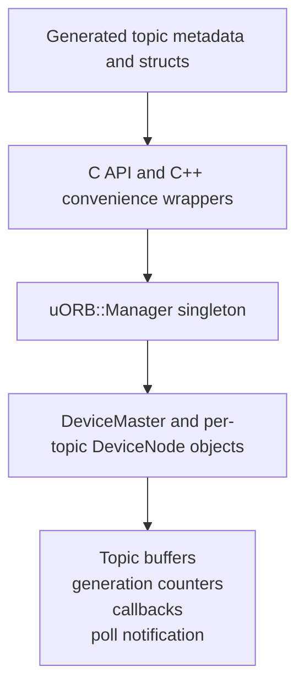
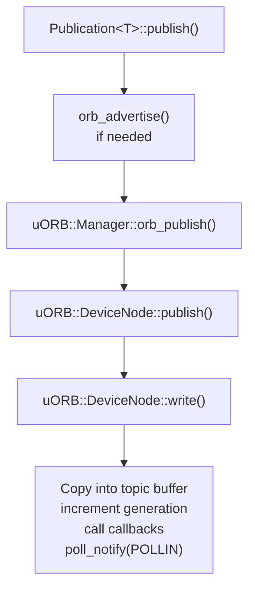
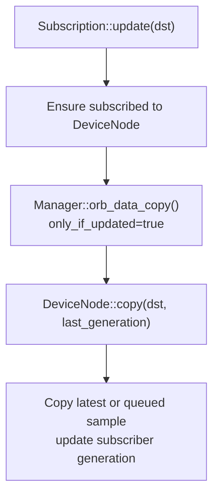
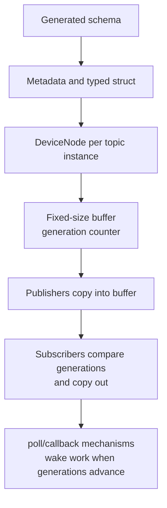

# uORB Middleware Architecture Deep Dive

This document is a deep-dive analysis of the PX4 uORB middleware implementation. It complements the user-facing [uORB Messaging](../middleware/uorb.md) guide by explaining the runtime object model, message-generation path, buffering semantics, scheduling hooks, diagnostics, and design tradeoffs.

The implementation discussed here lives primarily in [`platforms/common/uORB`](https://github.com/PX4/PX4-Autopilot/tree/main/platforms/common/uORB), with generated message code produced from [`msg`](https://github.com/PX4/PX4-Autopilot/tree/main/msg) by tools in [`Tools/msg`](https://github.com/PX4/PX4-Autopilot/tree/main/Tools/msg).

## Architectural Role

uORB is PX4's internal publish/subscribe middleware. It is not a general network middleware and it is not a DDS replacement. It is a low-latency, typed, in-process message bus that lets independently scheduled PX4 modules exchange state without direct dependencies on each other.

Its core responsibilities are:

- Provide a topic abstraction for sensor samples, state estimates, commands, setpoints, actuator demands, diagnostics, and status.
- Decouple producers and consumers in time and ownership: publishers do not wait for subscribers, and subscribers can join after publishers exist.
- Provide per-topic metadata generated from `.msg` files.
- Provide efficient latest-value delivery by default, with bounded ring buffers for selected command-like or bursty topics.
- Integrate with PX4's POSIX-like file-descriptor model so topics can be polled, listened to, and inspected from shell commands.
- Provide C and C++ APIs for modules, drivers, and system commands.

The result is a middleware layer that is intentionally simple: typed shared-memory copies, generation counters, optional small queues, and notification hooks.

## High-Level Structure

At runtime, uORB has four main layers:



Important files:

| Area | Source |
| - | - |
| Public C API and metadata definitions | [`platforms/common/uORB/uORB.h`](https://github.com/PX4/PX4-Autopilot/blob/main/platforms/common/uORB/uORB.h) |
| C API forwarding and shell-facing commands | [`platforms/common/uORB/uORB.cpp`](https://github.com/PX4/PX4-Autopilot/blob/main/platforms/common/uORB/uORB.cpp) |
| Singleton manager | [`platforms/common/uORB/uORBManager.hpp`](https://github.com/PX4/PX4-Autopilot/blob/main/platforms/common/uORB/uORBManager.hpp), [`uORBManager.cpp`](https://github.com/PX4/PX4-Autopilot/blob/main/platforms/common/uORB/uORBManager.cpp) |
| Topic registry | [`platforms/common/uORB/uORBDeviceMaster.hpp`](https://github.com/PX4/PX4-Autopilot/blob/main/platforms/common/uORB/uORBDeviceMaster.hpp), [`uORBDeviceMaster.cpp`](https://github.com/PX4/PX4-Autopilot/blob/main/platforms/common/uORB/uORBDeviceMaster.cpp) |
| Per-topic runtime object | [`platforms/common/uORB/uORBDeviceNode.hpp`](https://github.com/PX4/PX4-Autopilot/blob/main/platforms/common/uORB/uORBDeviceNode.hpp), [`uORBDeviceNode.cpp`](https://github.com/PX4/PX4-Autopilot/blob/main/platforms/common/uORB/uORBDeviceNode.cpp) |
| C++ publication wrappers | [`Publication.hpp`](https://github.com/PX4/PX4-Autopilot/blob/main/platforms/common/uORB/Publication.hpp), [`PublicationMulti.hpp`](https://github.com/PX4/PX4-Autopilot/blob/main/platforms/common/uORB/PublicationMulti.hpp) |
| C++ subscription wrappers | [`Subscription.hpp`](https://github.com/PX4/PX4-Autopilot/blob/main/platforms/common/uORB/Subscription.hpp), [`SubscriptionInterval.hpp`](https://github.com/PX4/PX4-Autopilot/blob/main/platforms/common/uORB/SubscriptionInterval.hpp), [`SubscriptionCallback.hpp`](https://github.com/PX4/PX4-Autopilot/blob/main/platforms/common/uORB/SubscriptionCallback.hpp) |
| Message generator | [`Tools/msg/px_generate_uorb_topic_files.py`](https://github.com/PX4/PX4-Autopilot/blob/main/Tools/msg/px_generate_uorb_topic_files.py) |
| Runtime command | [`src/systemcmds/uorb/uorb.cpp`](https://github.com/PX4/PX4-Autopilot/blob/main/src/systemcmds/uorb/uorb.cpp) |
| Topic listener | [`src/systemcmds/topic_listener`](https://github.com/PX4/PX4-Autopilot/tree/main/src/systemcmds/topic_listener) |

## Build-Time Topic Generation

uORB topics start as `.msg` files listed in [`msg/CMakeLists.txt`](https://github.com/PX4/PX4-Autopilot/blob/main/msg/CMakeLists.txt). The generator enforces two important contract rules:

- Every topic message must include a `uint64 timestamp` field.
- The `timestamp` field must have exactly the `uint64` type.

The generator then creates:

- A C/C++ struct for each message type.
- One or more `ORB_DECLARE()` declarations for the topic names.
- One `ORB_DEFINE()` definition per generated topic.
- A generated `ORB_ID` enum covering all topics.
- An `orb_metadata` record for each topic.
- Field-format metadata used by logging, printing, and message introspection.
- Optional IDL and JSON representations for bridge and tooling use.

### Topic Name Derivation

If a `.msg` file has no explicit topic list, the topic name is the snake_case form of the file name. For example:

```text
VehicleLocalPosition.msg -> vehicle_local_position
```

A message can define several topic names with the same wire/layout structure by using a `# TOPICS` line:

```text
# TOPICS actuator_outputs actuator_outputs_sim actuator_outputs_debug
```

This is different from multi-instance topics. Multi-topic messages create different topic IDs with the same struct. Multi-instance topics create several runtime instances of the same topic ID.

### Generated Metadata

The central metadata structure is:

```cpp
struct orb_metadata {
    const char *o_name;
    const uint16_t o_size;
    const uint16_t o_size_no_padding;
    uint32_t message_hash;
    orb_id_size_t o_id;
    uint8_t o_queue;
};
```

The metadata gives uORB enough information to:

- Validate publish/copy sizes.
- Allocate topic buffers.
- Print and log messages without hand-written topic code.
- Map `ORB_ID(topic_name)` to a stable generated metadata object.
- Preserve a message hash for compatibility-sensitive tooling.
- Know the default queue depth for the topic.

The generated C++ source performs a `static_assert` that the generated enum index and topic metadata agree. This catches mismatches between generated topic lists and topic definitions at build time.

### Layout and Padding

The generated C struct is sorted by field size to reduce padding. Nested messages are padded to an 8-byte alignment, and padding fields are generated where needed. The metadata stores both full struct size and size without final padding. The latter is important for logging and external format descriptions, where trailing padding is not semantic data.

### Queue Length

By default, a uORB topic has queue length 1. A `.msg` file can define:

```text
uint8 ORB_QUEUE_LENGTH = 4
```

The generator stores that value in `orb_metadata::o_queue`. Queue length is a per-topic property, not a subscriber property.

## Runtime Object Model

The runtime object model has three key classes:

| Class | Role |
| - | - |
| `uORB::Manager` | Singleton facade implementing advertise, publish, subscribe, copy, check, interval, and bridge hooks. |
| `uORB::DeviceMaster` | Registry of all created topic nodes. It owns the list of `DeviceNode` objects and the per-instance topic-existence bitsets. |
| `uORB::DeviceNode` | Runtime object for one topic instance. It owns the data buffer, generation counter, subscriber count, callback list, advertised flag, and poll notification state. |

The manager is initialized by `uorb_start()`. On normal PX4 startup, `uorb start` runs early because most modules depend on it.

Each topic instance has a path like:

```text
/obj/<topic_name><instance>
```

For instance:

```text
/obj/sensor_accel0
/obj/sensor_accel1
```

The path is generated by `uORB::Utils::node_mkpath()`. Instance index is encoded as the final path character, and `ORB_MULTI_MAX_INSTANCES` is constrained to 10 or fewer. On constrained-memory builds it is 4; otherwise it is 10.

`DeviceNode` inherits from PX4's character-device abstraction (`cdev::CDev`). This gives uORB a file-descriptor-compatible interface for `open`, `read`, `write`, `ioctl`, and `poll`, while still exposing faster internal C++ wrappers for most PX4 modules.

## Publish Path

The normal publish path is:



### Advertisement

Publishing requires an advertised topic. `orb_advertise()` creates or opens the relevant `DeviceNode`, marks it advertised, returns a publisher handle, and optionally performs an initial publish.

The publisher handle is effectively a `DeviceNode *`. It can be reused for later publishes and does not need to be a file descriptor. That matters because some publishers need to publish from contexts where a file descriptor is not convenient.

### First Allocation and Interrupt Context

`DeviceNode::write()` lazily allocates the topic buffer on first publish:

```text
buffer_size = metadata.o_size * metadata.o_queue
```

On NuttX, allocation is only attempted outside interrupt context. This is why a topic that will later be published from interrupt context must be advertised and published at least once from normal task context first. After allocation, later publishes are fixed-size copies into an existing buffer.

### Atomic Update

The write path uses a short atomic section:

1. Increment the topic generation counter.
2. Copy the message into the slot selected by `generation % queue_size`.
3. Invoke registered callbacks.
4. Mark the data valid.
5. Notify poll waiters.

Publishers do not wait for subscribers to consume data. The publisher cost is bounded by the fixed-size copy, callback scheduling, and poll notification.

## Subscribe and Copy Path

There are two main subscription styles:

- The C API, which returns a file descriptor from `orb_subscribe()` or `orb_subscribe_multi()`.
- C++ wrappers such as `uORB::Subscription`, `uORB::SubscriptionData<T>`, `uORB::SubscriptionInterval`, and `uORB::SubscriptionCallbackWorkItem`.

The normal C++ copy path is:



`Subscription::copy()` copies even if there is no new update. `Subscription::update()` only copies when the subscription has unseen data.

### Generation Counters

Each `DeviceNode` has a monotonically increasing `_generation` counter. Each subscription tracks its own `_last_generation`.

This is the core of uORB update detection:

```text
updates_available = node_generation - subscriber_last_generation
```

Unsigned arithmetic makes wraparound tolerable. The source comments note that wraparound occurs after roughly 49 days at 1 kHz publication rate.

### Latest-Value Topics

For queue length 1, a copy is simple:

```text
atomic:
  memcpy(dst, node_data, message_size)
  subscriber_generation = node_generation
```

This is ideal for state-like data where only the latest value matters: attitude, local position, battery status, control mode, estimator status, and most setpoints.

### Queued Topics

For queue length greater than 1, the node buffer is a ring:

```text
slot = generation % queue_size
```

The subscriber generation points to the next sample it wants to read. If the subscriber is too far behind, `DeviceNode::copy()` advances it to the oldest still-buffered sample. That prevents reading overwritten data, but it also means old samples can be skipped when readers cannot keep up.

This is appropriate for topics such as command streams where short bursts matter more than pure latest-value semantics.

## Notification Mechanisms

uORB provides three practical notification mechanisms.

### Poll

The C API can be used with `poll()` because subscriptions are file-descriptor compatible. `DeviceNode::poll_state()` checks whether the subscription has unseen data, and `poll_notify(POLLIN)` wakes waiters on publish.

The `listener` command uses this path to block until topic data arrives.

### Periodic Checks

Modules can call:

```cpp
if (_subscription.updated()) {
    _subscription.copy(&msg);
}
```

This is common in loops that already run for another reason.

### Callback Work Items

`uORB::SubscriptionCallbackWorkItem` registers a callback on the `DeviceNode`. On publish, the callback checks whether the subscription is updated and schedules a `px4::WorkItem`.

The callback itself should stay small. The normal pattern is:


This pattern is used throughout PX4 for low-latency reactive modules without dedicating one blocking thread per module.

## Subscription Intervals

`SubscriptionInterval` adds rate limiting at the subscriber side. It does not slow the publisher and does not change the topic queue. It only controls how often a particular subscriber reports an update.

The interval logic:

- If enough time has elapsed since the subscriber's last copy, `updated()` can return true.
- After a successful copy, `_last_update` is advanced while bounded to avoid long-term drift.
- Poll notification also respects whether the subscription appears updated to that subscriber.

This is useful for consumers that observe high-rate topics but only need lower-rate updates.

## Multi-Topic and Multi-Instance Semantics

uORB has two distinct multiplicity mechanisms.

### Multi-Topic Message Definition

A single `.msg` file can define several topics with the same struct:

```text
# TOPICS actuator_outputs actuator_outputs_sim actuator_outputs_debug
```

These are separate topic IDs. They share layout, but semantically they are distinct streams.

### Multi-Instance Topic

One topic ID can have several runtime instances:

```text
sensor_accel instance 0
sensor_accel instance 1
sensor_accel instance 2
```

This is used for multiple sensors, multiple estimator instances, multiple batteries, and similar replicated producers.

`orb_advertise_multi()` chooses an available instance. `orb_subscribe_multi()` subscribes to a specified instance. `SubscriptionMultiArray<T>` creates an array of subscriptions across instances.

The limit is `ORB_MULTI_MAX_INSTANCES`. Because the instance is encoded as a single path suffix, the limit must stay 10 or below.

## Topic Creation and Late Binding

uORB intentionally allows some late binding:

- A C API subscription can create a node before it is advertised.
- A topic can exist but not yet be advertised.
- `orb_exists()` checks whether a topic instance exists and has been advertised.
- C++ `Subscription` objects retry subscription when used, so a module can hold a subscription object even if the publisher is not ready yet.
- Callback registration has a fallback path that uses `orb_subscribe_multi()` to force topic creation before registering the callback.

This behavior lets startup order be flexible. For example, a controller can start before a sensor publisher and later begin receiving data when the sensor is advertised.

## C API vs C++ API

The C API is the lowest common denominator:

| C API | Purpose |
| - | - |
| `orb_advertise()` | Create/advertise topic instance 0. |
| `orb_advertise_multi()` | Create/advertise a multi-instance topic and return the chosen instance. |
| `orb_publish()` | Publish fixed-size data through an advertiser handle. |
| `orb_subscribe()` | Subscribe to instance 0 and return a file descriptor. |
| `orb_subscribe_multi()` | Subscribe to a specific instance. |
| `orb_copy()` | Copy topic data into a caller-owned struct. |
| `orb_check()` | Check for unseen updates on a subscription. |
| `orb_set_interval()` | Rate-limit update visibility for one subscription. |
| `orb_exists()` | Check whether a topic instance is advertised. |
| `orb_group_count()` | Count advertised instances. |

Most PX4 modules use the C++ wrappers because they reduce boilerplate and integrate better with work queues:

| C++ wrapper | Typical use |
| - | - |
| `uORB::Publication<T>` | Publish typed messages. |
| `uORB::PublicationData<T>` | Store an embedded message and publish it with `update()`. |
| `uORB::PublicationMulti<T>` | Publish a multi-instance topic. |
| `uORB::Subscription` | Lightweight untyped subscription wrapper. |
| `uORB::SubscriptionData<T>` | Subscription with embedded last-copied data. |
| `uORB::SubscriptionInterval` | Subscription with subscriber-side update throttling. |
| `uORB::SubscriptionCallbackWorkItem` | Schedule a work item when a topic updates. |
| `uORB::SubscriptionBlocking<T>` | Block on a topic update using a condition variable. |
| `uORB::SubscriptionMultiArray<T>` | Manage subscriptions to all instances of a topic. |

## Platform Integration

uORB is in `platforms/common` because the higher-level semantics are shared across NuttX, POSIX, and other PX4 targets.

On NuttX, the platform integration has two notable cases:

- Flat builds can call manager functions directly.
- Protected/kernel-style builds use `boardctl()` and uORB-specific IOCTLs to cross the user/kernel boundary for manager operations.

The same high-level API remains visible to modules, but the implementation path differs depending on build configuration.

The implementation uses PX4's POSIX abstraction layer (`px4_open`, `px4_close`, `px4_read`, `px4_ioctl`, `poll`) so module code can remain portable across PX4-supported runtimes.

## Remote and Bridge Hooks

The core uORB middleware is local, but it has optional hooks for remote forwarding:

- `CONFIG_ORB_COMMUNICATOR` enables a `uORBCommunicator::IChannel`.
- Remote topic advertisements can mark local nodes as advertised.
- Local topic advertisements and subscriptions can be forwarded to a remote side.
- Received remote messages are written into the local `DeviceNode`.

This is separate from application-level bridge modules such as:

- `mavlink`
- `uxrce_dds_client`
- `zenoh`
- `muorb`
- Cyphal publisher/subscriber helpers

Those modules convert between uORB and an external protocol. The uORB core remains the local typed bus.

## Diagnostics and Introspection

Useful operational commands:

| Command | What it uses | Purpose |
| - | - | - |
| `uorb status` | `DeviceMaster::printStatistics()` | Print created/advertised topic nodes, instance, subscriber count, queue size, message size, and path. |
| `uorb top` | `DeviceMaster::showTop()` | Monitor publication rates and aggregate throughput. |
| `uorb top -a` | `showTop()` with all topics | Show inactive topics too. |
| `uorb top -1` | one-shot top | Print once and exit. |
| `listener <topic>` | `orb_exists`, `orb_subscribe`, `poll`, `orb_copy` | Print topic values. |
| `listener <topic> -i <n>` | multi-instance subscribe | Inspect a specific instance. |
| `listener <topic> -r <hz>` | subscription interval | Print at a controlled rate. |

For structural analysis, the [uORB Publication/Subscription Graph](../middleware/uorb_graph.md) extracts publication and subscription relationships from source code and renders module-topic relationships.

## Performance Model

uORB is optimized for the common PX4 case:

- Many topics are small fixed-size structs.
- Most consumers only need the latest value.
- Publishers must not block on subscribers.
- High-rate paths should avoid dynamic allocation after startup.
- Work queues should wake from topic updates without polling loops.

The main publish cost is:

```text
fixed-size memcpy + generation update + callback scheduling + poll notification
```

The main subscriber cost is:

```text
generation check + fixed-size memcpy when updated
```

Memory use per advertised topic instance is approximately:

```text
sizeof(DeviceNode) + (message_size * queue_length) + callback/subscriber bookkeeping
```

Because queue length is per topic, queueing a large high-rate topic has a direct RAM cost. This is why most topics stay at queue length 1.

## Design Analysis

### Strengths

- **Low coupling:** Modules depend on topic contracts, not each other.
- **Low latency:** A publish is a bounded local memory operation.
- **Small runtime model:** There is no dynamic type discovery protocol inside the flight controller; topic metadata is generated at build time.
- **Deterministic memory shape after initialization:** Once topic buffers are allocated, publishing avoids per-message allocation.
- **Multiple integration styles:** Polling, callback work items, blocking waits, and periodic checks all use the same underlying generation counters.
- **Good debug surface:** `listener`, `uorb top`, message printing, logging metadata, and generated docs all come from the same schema source.

### Tradeoffs

- **Bounded history only:** uORB is not a durable event log. Queue length 1 overwrites old data; larger queues are still finite.
- **No ownership arbitration by default:** Multiple publishers can publish the same topic. uORB makes each publication atomic, but it does not decide which publisher is authoritative.
- **No semantic QoS negotiation:** Queue depth, timing, and compatibility are static topic-level or subscriber-side choices.
- **Schema changes are high impact:** Because generated structs are used in firmware, logging, and bridges, message changes must be treated as API changes.
- **Callback work must stay minimal:** Callbacks happen on the publish path. Heavy work should be deferred to scheduled work items.
- **Late subscribers may miss history:** A subscriber can see the latest value or the queued window, not arbitrary earlier samples.

### Why This Fits PX4

PX4's flight stack is dominated by state streams and setpoint streams where "latest value wins" is usually correct. Estimators, controllers, and managers need typed, low-latency data without depending on each other's classes. uORB gives PX4 that with minimal runtime machinery.

For external ecosystems such as ROS 2, PX4 uses bridge modules that translate selected uORB topics into middleware-specific concepts. That keeps the flight controller's internal bus simple while still allowing richer offboard integration.

## Failure Modes and Debug Strategy

### Unknown Topic

If a topic has no generated metadata, `orb_advertise()` and `orb_subscribe()` fail with `ENOENT`. Check that the `.msg` file is listed in `msg/CMakeLists.txt` and that generated headers are included correctly.

### Topic Exists but Is Not Advertised

A subscription can exist before a publisher starts. `updated()` remains false and `copy()` fails until the topic is advertised and data is published. Use:

```sh
uorb status
listener <topic>
```

to distinguish "not generated", "node exists", and "advertised with data".

### Wrong Buffer Size or Metadata Mismatch

`DeviceNode::read()` and `write()` check the message size. `DeviceNode::publish()` also checks that the publisher handle's topic ID matches the metadata passed to `orb_publish()`. A mismatch is a programming error, not a runtime negotiation failure.

### Queue Overrun

If a queued subscriber falls behind, the copy logic advances it to the oldest still-buffered sample. This avoids stale overwritten reads, but skipped samples are possible. Increase `ORB_QUEUE_LENGTH` only when the topic semantics require it and the RAM cost is acceptable.

### Callback Not Firing

Check that:

- The topic is advertised or callback registration forced topic creation.
- The callback is still registered.
- The subscription interval is not filtering updates.
- The publisher is publishing the expected instance.
- The work item is not blocked or starved by other work on the same queue.

### Interrupt Publish Fails

If a topic is published from interrupt context before its buffer is allocated, allocation cannot happen there. Advertise and publish once from normal task context before interrupt-time publishing.

### Multiple Publishers on One Topic

uORB permits multiple publishers for a topic. If the topic is meant to have one authoritative owner, enforce that convention at the module level or use publisher rules in replay/testing builds. Do not rely on uORB to arbitrate ownership.

## Extension Guidance

When adding or changing a uORB topic:

1. Use a `.msg` file in `msg` or `msg/versioned`.
2. Add the file to `msg/CMakeLists.txt`.
3. Include `uint64 timestamp`.
4. Use SI units and document units in field comments.
5. Prefer queue length 1 unless the topic is command-like or bursty.
6. Use `# TOPICS` only when separate semantic streams share the same layout.
7. Use multi-instance publication when the same semantic stream has multiple physical or logical sources.
8. Treat versioned messages as external API and follow the versioning workflow.
9. Update bridge topic lists such as `dds_topics.yaml` only when the topic should be exposed externally.
10. Use `listener`, `uorb top`, and logs to validate runtime behavior.

When consuming a topic:

- Use `SubscriptionCallbackWorkItem` for reactive work-queue modules.
- Use `SubscriptionInterval` when a high-rate topic only needs lower-rate observation.
- Use `SubscriptionMultiArray` when all instances matter.
- Check validity fields inside the message; uORB only transports data and does not interpret semantic validity.
- Be explicit about which module owns the resulting behavior if several subscribers react to the same command topic.

## Mental Model

The simplest accurate model is:



Everything else in uORB is there to make that model practical inside PX4: generated topic IDs, file-descriptor compatibility, multi-instance paths, bounded queues, subscriber intervals, shell diagnostics, optional bridge hooks, and C++ wrappers for module code.
